# frappe_itsm — Complete Process Flowcharts
> **All 10 ITSM modules + Cross-Module Integration Map**
> Source: frappe_itsm PRD v1.0 | ITIL v4 Aligned | ISO/IEC 20000-1:2018
> Built for: Developers, Business Analysts, AI Agents, Product Teams

---

## Table of Contents

| # | Module | Key Flow Stages |
|---|--------|----------------|
| 1 | [Incident Management](#1-incident-management) | Intake → Triage → Assign → Work → SLA → Resolve → Close |
| 2 | [Problem Management](#2-problem-management) | Identify → RCA → KEDB → RFC → Resolve → PIR |
| 3 | [Change Management](#3-change-management) | Standard / Normal (CAB) / Emergency (ECAB) |
| 4 | [CMDB](#4-cmdb) | CI Create → Attributes → Relationships → Lifecycle → Impact |
| 5 | [Service Catalog](#5-service-catalog) | Admin Build → Browse → Submit → Approve → Fulfill |
| 6 | [Knowledge Base](#6-knowledge-base) | Author → Review → Publish → Deflect → Maintain |
| 7 | [Omnichannel Communication](#7-omnichannel-communication) | Ingest → Route → Inbox → Bot → Handoff → CSAT |
| 8 | [Reporting & Dashboards](#8-reporting--dashboards) | Render → Drill-down → Schedule → KPI Alerts |
| 9 | [AI & Virtual Agent](#9-ai--virtual-agent) | Classify → Reply Assist → Chatbot → Dedup |
| 10 | [Asset Management](#10-asset-management) | Procure → Deploy → Depreciate → Dispose / License Compliance |
| 11 | [Integration Map](#11-cross-module-integration-map) | All modules + ERPNext + SLA Engine + Workflow Engine |

---

## Colour & Shape Legend

| Shape / Style | Meaning |
|---------------|---------|
| `[ ]` Rectangle | Process step performed by a human or system |
| `{ }` Diamond | Decision point — flow branches YES or NO |
| `([ ])` Stadium | Start or End state |
| `[[ ]]` Subroutine box | Automated system trigger / background job |
| `( )` Rounded rectangle | Sub-process or grouped activity |
| **Blue nodes** | Agent / human-driven steps |
| **Amber nodes** | Decision gates |
| **Purple nodes** | Automated system actions |
| **Green nodes** | Success / completion steps |
| **Red nodes** | Exception / failure / escalation paths |
| **Teal nodes** | Cross-module integration points |

---

## 1. Incident Management

> **Purpose:** Restore normal service operation as quickly as possible with minimum disruption. Every service disruption from every channel enters here, gets prioritised, tracked against SLA, and resolved with a full audit trail.

**Actors:** End User · ITSM Agent · Senior Agent · IT Manager · Major Incident Manager · Assignment Engine (system) · SLA Engine (system)

**Naming Series:** `INC-YYYY-#####`

```mermaid
flowchart TD
    INC_START([🟢 Incident Triggered]) --> INC_CH

    subgraph INC_STAGE_A["📥 Stage A — Multi-Channel Intake"]
        INC_CH["Channel arrives via one of 6 paths:<br/>Email — IMAP polling every 2 min<br/>Web Portal — Employee or Customer portal form<br/>WhatsApp — Meta Cloud API inbound webhook<br/>Live Chat — Socket.io real-time message<br/>Voice — Twilio / Exotel CTI screen pop<br/>REST API — programmatic submission"]
        INC_CH --> INC_NORM["Omnichannel Engine normalises input<br/>Creates single ITSM Incident record<br/>source_channel field recorded"]
    end

    INC_NORM --> INC_AUTO1

    subgraph INC_AUTO1["⚡ Auto-Trigger — On Incident Created"]
        INC_A1["• Naming series assigned: INC-YYYY-#####<br/>• raised_by linked to authenticated user or contact lookup<br/>• AI classifier suggests: Category, Sub-Category, Impact, Urgency, Priority<br/>• Duplicate check: scan open INCs same category + requester — alert banner if match<br/>• Status set to: New"]
    end

    INC_AUTO1 --> INC_STAGE_B

    subgraph INC_STAGE_B["🔍 Stage B — Triage & Classification"]
        INC_CAT["Agent selects or confirms AI-suggested<br/>Category and Sub-Category<br/>Filtered by company context"]
        INC_CAT --> INC_PRIO["Agent selects Impact and Urgency<br/>Server hook reads ITSM Priority Matrix<br/>Priority auto-calculated P1 to P5<br/>P1 = Enterprise-Wide + Critical<br/>P5 = Individual + Low"]
    end

    INC_PRIO --> INC_MAJDEC

    INC_MAJDEC{Is this a<br/>Major Incident?<br/>Enterprise-wide<br/>or multi-team?}
    INC_MAJDEC -->|YES| INC_MAJOR["🚨 Major Incident Protocol activated<br/>• is_major_incident flag = true<br/>• Major Incident Manager assigned — mandatory<br/>• Bridge notification sent to all stakeholders<br/>• Child incidents grouped under this parent<br/>• Separate SLA tracking for parent record"]
    INC_MAJOR --> INC_ASSIGN
    INC_MAJDEC -->|NO — Standard flow| INC_ASSIGN

    subgraph INC_STAGE_C["🎯 Stage C — Assignment"]
        INC_ASSIGN["Assignment Engine evaluates ITSM Automation Rules<br/>Conditions checked: category · priority · department · company<br/>First matching rule wins"]
        INC_ASSIGN --> INC_ROUTE["assigned_team set from matching rule<br/>Within team: round-robin OR least-loaded agent<br/>Agent presence status checked — Offline agents skipped<br/>Status: New → Assigned"]
    end

    INC_ROUTE --> INC_AUTO2

    subgraph INC_AUTO2["⚡ Auto-Trigger — On Assignment"]
        INC_A2["• Notification sent to assigned agent — email + in-app<br/>• SLA Engine creates ITSM SLA Instance linked to this incident<br/>• response_due calculated using working hours + holiday list<br/>• resolution_due calculated for selected priority<br/>• Background evaluator job starts — runs every 5 minutes<br/>• sla_status set to: Within SLA"]
    end

    INC_AUTO2 --> INC_STAGE_D

    subgraph INC_STAGE_D["🔧 Stage D — Active Work"]
        INC_OPEN["Agent opens ticket<br/>Status: Assigned → In Progress<br/>first_response_at timestamp recorded<br/>First public reply sent via ORIGINAL channel"]
        INC_OPEN --> INC_KEDB["Agent checks KEDB panel — right side of form<br/>System queries Problems where status = Known Error<br/>and category matches this incident<br/>Workaround displayed if found"]
        INC_KEDB --> INC_KB["KB suggestion panel shows matching articles<br/>Agent can apply workaround and fast-track to Resolved<br/>KB article view tracked for deflection metrics"]
        INC_KB --> INC_CI["Agent links affected CIs from CMDB<br/>ITSM Incident CI child table populated<br/>Each linked CI shows this incident in reverse lookup<br/>Impact analysis available from CI record"]
    end

    INC_CI --> INC_HOLDDEC

    INC_HOLDDEC{Waiting on:<br/>Requester response,<br/>Vendor delivery, or<br/>Scheduled change?}
    INC_HOLDDEC -->|YES — Put On Hold| INC_PENDING["Status → Pending<br/>on_hold_reason required — select from:<br/>Awaiting User / Awaiting Vendor / Awaiting Change / Scheduled Maintenance / Other<br/>SLA timer PAUSED immediately<br/>on_hold_since timestamp recorded"]
    INC_PENDING -->|Customer replies OR agent manually resumes| INC_RESUME["Status: Pending → In Progress<br/>SLA timer RESUMES<br/>Hold duration logged to ITSM SLA Hold Log<br/>Total hold time subtracted from SLA elapsed calculation"]
    INC_RESUME --> INC_SLA
    INC_HOLDDEC -->|NO — Continue working| INC_SLA

    subgraph INC_STAGE_E["⏱️ Stage E — SLA Monitoring — Background job every 5 minutes"]
        INC_SLA["SLA Evaluator compares elapsed_time vs response_due and resolution_due<br/>Evaluates every 5 minutes for all open non-paused incidents"]
        INC_SLA --> INC_SLA50["50% of resolution_due elapsed<br/>→ In-app + email notification to assigned agent"]
        INC_SLA --> INC_SLA75["75% of resolution_due elapsed<br/>→ Notify agent + team lead<br/>→ sla_status = At Risk"]
        INC_SLA --> INC_SLA100["100% elapsed — SLA BREACHED<br/>→ sla_status = Breached<br/>→ L1 Escalation: reassign to Senior Agent<br/>→ Notify IT Manager immediately"]
        INC_SLA --> INC_SLA125["125% elapsed — CRITICAL BREACH<br/>→ L2 Escalation: notify IT Director<br/>→ Priority auto-upgraded one level<br/>→ Major Incident review triggered"]
    end

    INC_SLA --> INC_RESOLVE

    subgraph INC_STAGE_F["✅ Stage F — Resolution"]
        INC_RESOLVE["Agent selects resolution_code — required field<br/>Fills resolution_notes — required field<br/>Validation: both fields checked before transition<br/>Status: In Progress → Resolved"]
    end

    INC_RESOLVE --> INC_AUTO3

    subgraph INC_AUTO3["⚡ Auto-Trigger — On Resolution"]
        INC_A3["• resolution_at timestamp recorded<br/>• SLA fulfillment status finalised: Fulfilled or Breached<br/>• CSAT survey triggered via ORIGINAL channel:<br/>  Email: HTML survey link<br/>  WhatsApp: Interactive Message with 1-5 star buttons<br/>  Chat: Inline rating widget<br/>• 72-hour auto-close timer starts — checked every 30 min<br/>• Watch list users notified of resolution"]
    end

    INC_AUTO3 --> INC_DISPDEC

    INC_DISPDEC{Requester disputes<br/>resolution within<br/>72 hours?}
    INC_DISPDEC -->|YES — Requester replies with dispute| INC_REOPEN["Status: Resolved → In Progress<br/>reopened_count incremented by 1<br/>New ITSM SLA Instance created for this reopening<br/>Reopen metric recorded — affects SLA compliance KPI"]
    INC_REOPEN --> INC_OPEN
    INC_DISPDEC -->|NO — No dispute or 72h elapses| INC_CLOSE

    subgraph INC_STAGE_G["🔒 Stage G — Closure"]
        INC_CLOSE["Auto-closed by system after 72 hours from resolution_at<br/>OR requester clicks Confirm Resolved on portal<br/>closed_at timestamp recorded<br/>Status: Resolved → Closed"]
    end

    INC_CLOSE --> INC_AUTO4

    subgraph INC_AUTO4["⚡ Auto-Trigger — On Closure"]
        INC_A4["• CSAT score linked to agent performance record<br/>• KPIs updated: MTTR · FCR · SLA compliance rate · Reopen rate<br/>• If is_major_incident = true: PIR task auto-created for Major Incident Manager<br/>• Linked Problem record notified of incident closure<br/>• Operations Dashboard data refreshed"]
    end

    INC_AUTO4 --> INC_END([🏁 Incident Closed])

    subgraph INC_EXCEPT["⚠️ Exception Flows"]
        INC_EX1["Duplicate detected: alert banner — agent can Merge or Dismiss"]
        INC_EX2["No agent available: stays in queue — IT Manager notified at 15 min, escalation at 30 min"]
        INC_EX3["Cancelled: reason required — no SLA impact if cancelled within 15 min of creation"]
        INC_EX4["Major Incident Manager not assigned in 30 min: auto-escalate to IT Manager"]
    end

    classDef stepStyle fill:#EFF6FF,stroke:#3B82F6,color:#1E3A8A
    classDef decStyle fill:#FFFBEB,stroke:#F59E0B,color:#78350F
    classDef autoStyle fill:#F5F3FF,stroke:#8B5CF6,color:#4C1D95
    classDef successStyle fill:#ECFDF5,stroke:#10B981,color:#065F46
    classDef errorStyle fill:#FEF2F2,stroke:#EF4444,color:#7F1D1D
    classDef startEnd fill:#F0F9FF,stroke:#0EA5E9,color:#0C4A6E

    class INC_CH,INC_NORM,INC_CAT,INC_PRIO,INC_ASSIGN,INC_ROUTE,INC_OPEN,INC_KEDB,INC_KB,INC_CI,INC_RESOLVE,INC_CLOSE stepStyle
    class INC_MAJDEC,INC_HOLDDEC,INC_DISPDEC decStyle
    class INC_A1,INC_A2,INC_A3,INC_A4,INC_AUTO1,INC_AUTO2,INC_AUTO3,INC_AUTO4 autoStyle
    class INC_MAJOR,INC_PENDING,INC_SLA100,INC_SLA125,INC_EX1,INC_EX2,INC_EX3,INC_EX4 errorStyle
    class INC_RESUME,INC_REOPEN,INC_SLA50,INC_SLA75 stepStyle
    class INC_START,INC_END startEnd
```

**SLA Default Targets by Priority:**
| Priority | Calc | First Response | Resolution | Auto-Close |
|----------|------|----------------|------------|------------|
| P1 Critical | Enterprise+Critical | 15 min | 4 h | 24 h |
| P2 High | Dept+Critical or Enterprise+High | 30 min | 8 h | 48 h |
| P3 Moderate | Group+High or Dept+Medium | 2 h | 24 h | 72 h |
| P4 Low | Individual+High or Group+Medium | 4 h | 72 h | 7 d |
| P5 Planning | Individual+Low | 1 business day | 5 business days | 14 d |

**Key Business Rules:**
- `resolution_code` and `resolution_notes` are mandatory before status can change to Resolved
- `on_hold_reason` is mandatory before status can change to Pending
- Reopening a Resolved incident always increments `reopened_count` and creates a new SLA Instance
- SLA timer only counts working hours — configured in ITSM Working Hours and ITSM Holiday List
- Major Incident flag is irreversible once set without manager-level role

**KPIs Produced:**
| KPI | Formula | Target |
|-----|---------|--------|
| SLA Compliance Rate | Incidents within SLA / Total × 100 | ≥ 92% |
| First Call Resolution | Closed without reassignment / Total × 100 | ≥ 70% |
| MTTR (respond) | Avg(first_response_at − created_at) | P3 < 2h |
| MTTR (resolve) | Avg(resolution_at − created_at) | P3 < 24h |
| CSAT Score | Avg post-resolution rating 1–5 | ≥ 4.2 / 5 |
| Reopen Rate | Reopened / Resolved × 100 | < 3% |

---

## 2. Problem Management

> **Purpose:** Identify and eliminate the root cause of one or more incidents to prevent recurrence. The Known Error Database (KEDB) stores confirmed problems with workarounds so agents can resolve related incidents instantly without waiting for the permanent fix.

**Actors:** Agent · IT Manager · Problem Owner · Investigation Team · Change Manager · KB Author

**Naming Series:** `PRB-YYYY-#####`

```mermaid
flowchart TD
    PRB_START([🟢 Problem Triggered]) --> PRB_CREATE

    subgraph PRB_STAGE_A["📥 Stage A — Problem Identification — 3 Entry Paths"]
        PRB_PATH1["Path 1 — Agent promotes from Incident<br/>Click Create Problem button on any ITSM Incident<br/>PRB pre-filled: category, description, linked incident<br/>Bidirectional link created automatically"]
        PRB_PATH2["Path 2 — Proactive creation by IT Manager<br/>IT Manager raises PRB without a triggering incident<br/>Used for known risks, audit findings, architecture gaps"]
        PRB_PATH3["Path 3 — Auto-suggestion by system<br/>Background job detects 3+ open incidents<br/>same category within 2 hours<br/>Creates ITSM Problem Suggestion record<br/>Notifies IT Manager to review"]
        PRB_PATH1 & PRB_PATH2 & PRB_PATH3 --> PRB_CREATE["ITSM Problem record created<br/>Naming series: PRB-YYYY-#####<br/>All source incidents linked in ITSM Problem Incident child table"]
    end

    PRB_CREATE --> PRB_AUTO1

    subgraph PRB_AUTO1["⚡ Auto-Trigger — On Problem Created"]
        PRB_A1["• Naming series: PRB-YYYY-#####<br/>• Linked incidents listed in child table<br/>• problem_owner field must be assigned before Assess transition<br/>• Status set to: New"]
    end

    PRB_AUTO1 --> PRB_ASSESS

    subgraph PRB_STAGE_B["🔍 Stage B — Assessment"]
        PRB_ASSESS["Problem Owner reviews all linked incidents<br/>Determines scope: category, affected services, user count<br/>Assigns Priority P1 to P4 based on business impact<br/>Status: New → Assess"]
    end

    PRB_ASSESS --> PRB_RCA

    subgraph PRB_STAGE_C["🔬 Stage C — Root Cause Analysis"]
        PRB_RCA["Problem Owner selects RCA methodology:<br/>5-Whys — structured why chain<br/>Fishbone — cause and effect diagram<br/>Fault Tree — logical failure decomposition<br/>Timeline Analysis — chronological event mapping<br/>Status: Assess → Root Cause Analysis"]
        PRB_RCA --> PRB_TASKS["Problem Tasks created for parallel investigation<br/>Each task has own status, assignee, due date<br/>Example: Network Team task + App Team task run simultaneously<br/>All tasks visible on problem record"]
        PRB_TASKS --> PRB_ROOTFOUND["Root cause identified and documented<br/>root_cause field populated<br/>root_cause_category selected:<br/>Hardware Failure / Software Bug / Config Error / Process Gap / Human Error / Vendor"]
    end

    PRB_ROOTFOUND --> PRB_FIXDEC

    PRB_FIXDEC{Can permanent fix<br/>be implemented now?<br/>Resources available?}
    PRB_FIXDEC -->|YES — Immediate fix achievable| PRB_RFC["Create RFC button clicked<br/>ITSM Change record auto-created<br/>Pre-filled: problem title, category, linked_problem reference<br/>Change follows full Change Management lifecycle<br/>Status: Root Cause Analysis → Fix in Progress"]
    PRB_RFC --> PRB_FIXDEPLOY
    PRB_FIXDEC -->|NO — Fix deferred or complex| PRB_KNOWNERR

    subgraph PRB_STAGE_KE["📚 Stage C2 — Known Error & KEDB"]
        PRB_KNOWNERR["Status → Known Error<br/>Root cause known but fix planned for later<br/>Workaround documented in workaround field<br/>error_code assigned: e.g. KEDB-NET-001"]
        PRB_KNOWNERR --> PRB_WAPUB["Problem Owner checks workaround_published = true<br/>Workaround now visible in KEDB sidebar<br/>during incident creation for matching categories<br/>Agents can copy workaround to incident with one click"]
    end

    PRB_WAPUB --> PRB_AUTO2

    subgraph PRB_AUTO2["⚡ Auto-Trigger — On Workaround Published"]
        PRB_A2["• KEDB lookup activated for this category<br/>• All future incidents in same category see workaround in right panel<br/>• KB article auto-drafted: ITSM Knowledge Article in Draft status<br/>  Pre-filled with problem title and workaround text<br/>• All linked incident agents notified: Workaround now available<br/>• linked incidents can be fast-resolved using the workaround"]
    end

    PRB_AUTO2 --> PRB_RFCLATER["RFC raised when resources available<br/>Change Manager creates ITSM Change from problem<br/>linked_change field set on problem record<br/>Status: Known Error → Fix in Progress"]
    PRB_RFCLATER --> PRB_FIXDEPLOY

    subgraph PRB_STAGE_D["🔧 Stage D — Permanent Fix Deployment"]
        PRB_FIXDEPLOY["Change implemented and closed<br/>Change record notifies linked problem on closure<br/>Problem Owner verifies: are linked incidents no longer recurring?<br/>permanent_fix field documented<br/>resolution_notes completed"]
    end

    PRB_FIXDEPLOY --> PRB_RESOLVE

    subgraph PRB_STAGE_E["✅ Stage E — Resolution"]
        PRB_RESOLVE["permanent_fix documented — required<br/>Resolution confirmed against linked incidents<br/>resolution_notes required before transition<br/>Status → Resolved"]
    end

    PRB_RESOLVE --> PRB_AUTO3

    subgraph PRB_AUTO3["⚡ Auto-Trigger — On Problem Resolved"]
        PRB_A3["• Linked incidents still in Resolved state auto-closed<br/>• If pir_required = true: PIR task auto-created, assigned to problem_owner<br/>  Problem CANNOT close until PIR task is completed<br/>• KEDB entry archived: workaround retained but marked Resolved<br/>• Problem metrics updated: time-in-state, linked incident count<br/>• Recurrence rate recalculated"]
    end

    PRB_AUTO3 --> PRB_PIRDEC

    PRB_PIRDEC{pir_required = true?<br/>Failed fix, high risk,<br/>or major incident?}
    PRB_PIRDEC -->|YES — PIR required| PRB_PIR["PIR task assigned to problem_owner<br/>PIR documents: what happened, what went wrong,<br/>lessons learned, process improvements, prevention measures<br/>PIR findings optionally converted to KB article<br/>Problem BLOCKED from closing until PIR task = Completed"]
    PRB_PIR --> PRB_CLOSE
    PRB_PIRDEC -->|NO — PIR waived| PRB_CLOSE

    subgraph PRB_STAGE_F["🔒 Stage F — Closure"]
        PRB_CLOSE["PIR completed OR waived<br/>All problem tasks closed<br/>Status → Closed<br/>closed_at timestamp recorded<br/>Problem lifecycle ended"]
    end

    PRB_CLOSE --> PRB_END([🏁 Problem Closed])

    classDef stepStyle fill:#EFF6FF,stroke:#3B82F6,color:#1E3A8A
    classDef decStyle fill:#FFFBEB,stroke:#F59E0B,color:#78350F
    classDef autoStyle fill:#F5F3FF,stroke:#8B5CF6,color:#4C1D95
    classDef successStyle fill:#ECFDF5,stroke:#10B981,color:#065F46
    classDef kedbStyle fill:#F0FDFA,stroke:#0D9488,color:#134E4A

    class PRB_ASSESS,PRB_RCA,PRB_TASKS,PRB_ROOTFOUND,PRB_RFCLATER,PRB_FIXDEPLOY,PRB_RESOLVE,PRB_CLOSE stepStyle
    class PRB_FIXDEC,PRB_PIRDEC decStyle
    class PRB_A1,PRB_A2,PRB_A3 autoStyle
    class PRB_PIR,PRB_RFC successStyle
    class PRB_KNOWNERR,PRB_WAPUB kedbStyle
```

**Key Business Rules:**
- A problem can only transition to Assess after `problem_owner` is assigned
- A problem in Known Error state is queryable during incident creation — agents see the workaround in a sidebar panel
- `pir_required` is automatically set to `true` for failed changes linked to this problem
- Problem tasks support parallel execution — multiple teams investigate simultaneously
- Closure is blocked if any PIR tasks remain incomplete

---

## 3. Change Management

> **Purpose:** Control the lifecycle of all IT changes to minimise risk while enabling delivery speed. Three change types with distinct approval paths ensure routine changes move fast while high-risk changes receive full governance.

**Actors:** Change Initiator · Technical Reviewer · Change Manager · CAB Members · ECAB Members · Change Owner · PIR Lead

**Naming Series:** `RFC-YYYY-#####`

### 3a. Standard Change (Low Risk — Pre-Approved)

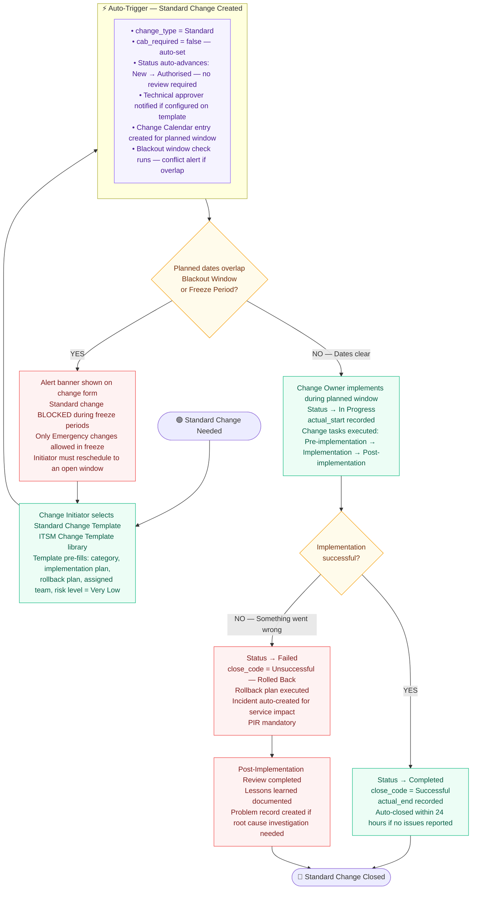

### 3b. Normal Change (Medium–High Risk — Full CAB Required)

```mermaid
flowchart TD
    NRM_START([🟢 Normal Change Needed]) --> NRM_DRAFT

    subgraph NRM_STAGE_A["📝 Stage A — RFC Drafting"]
        NRM_DRAFT["Change Initiator fills all mandatory fields:<br/>Title, change_type = Normal, description, business justification<br/>implementation_plan — step-by-step procedure<br/>rollback_plan — MANDATORY for Normal changes<br/>test_plan, planned_start, planned_end<br/>affected CIs linked, affected services listed<br/>downtime_expected flag + window if yes"]
        NRM_DRAFT --> NRM_RISK["System evaluates 5-factor Risk Assessment Questionnaire:<br/>1. Number of CIs affected — weight 25%<br/>2. Business criticality of affected CIs — weight 25%<br/>3. Previous change failure rate — weight 20%<br/>4. Rollback plan tested? — weight 15%<br/>5. Implementation window risk — weight 15%<br/>risk_score computed 0–100<br/>risk_level set: Very Low / Low / Medium / High / Very High"]
    end

    NRM_RISK --> NRM_BLACKOUT

    NRM_BLACKOUT{Planned dates<br/>overlap Blackout<br/>Window or Freeze Period?}
    NRM_BLACKOUT -->|YES| NRM_BCONFLICT["Alert banner: blackout_conflict = true<br/>Manager can override with written justification<br/>Override logged in audit trail<br/>Standard and Normal changes BLOCKED in freeze periods<br/>Only Emergency changes allowed during freeze"]
    NRM_BCONFLICT -->|Reschedule or override approved| NRM_SUBMIT
    NRM_BLACKOUT -->|NO| NRM_SUBMIT

    NRM_SUBMIT["Change Initiator submits for review<br/>Status → Pending Review<br/>Technical Reviewer assigned — mandatory for Normal changes<br/>Reviewer notified via email + in-app"]

    NRM_SUBMIT --> NRM_TECHREV

    subgraph NRM_STAGE_B["🔍 Stage B — Technical Review"]
        NRM_TECHREV["Technical Reviewer assesses:<br/>• Implementation plan completeness and feasibility<br/>• Rollback plan validity — can it actually undo the change?<br/>• CI impact accuracy — are all affected CIs listed?<br/>• Test plan adequacy — are acceptance criteria defined?<br/>• Risk score accuracy — is auto-calculated risk appropriate?"]
    end

    NRM_TECHREV --> NRM_TECHAPPRD

    NRM_TECHAPPRD{Technical Reviewer<br/>approves?}
    NRM_TECHAPPRD -->|NO — Reject with comments| NRM_TECHREJECT["Status → Draft<br/>Rejection reason and comments recorded<br/>Change Initiator notified<br/>Initiator must revise and resubmit"]
    NRM_TECHREJECT --> NRM_DRAFT
    NRM_TECHAPPRD -->|YES — Technical review passed| NRM_CABSCHED

    subgraph NRM_STAGE_C["🏛️ Stage C — CAB Review"]
        NRM_CABSCHED["Change added to next CAB Meeting agenda<br/>Status → CAB Scheduled<br/>cab_meeting linked on RFC<br/>All CAB members notified of upcoming agenda<br/>Change Manager confirms quorum availability"]
        NRM_CABSCHED --> NRM_CABPRES["CAB Meeting — Change Manager chairs<br/>Change Owner presents the RFC<br/>Members discuss: risk · impact · timing · conflicts<br/>Each member votes: Approve or Reject<br/>Email-based voting: signed URL token — no login required<br/>Quorum threshold: 51% of members by default"]
    end

    NRM_CABPRES --> NRM_CABAUTO

    subgraph NRM_CABAUTO["⚡ Auto-Trigger — On CAB Vote Completed"]
        NRM_CA["• Quorum check: minimum % of members voted<br/>• If majority Approve: Status → CAB Approved<br/>• If majority Reject: Status → Draft — initiator notified with all rejection reasons<br/>• All voter decisions logged: user + timestamp + comment + vote<br/>• CAB meeting minutes updated automatically"]
    end

    NRM_CABAUTO --> NRM_CABDEC

    NRM_CABDEC{CAB decision:<br/>Majority approved<br/>and quorum met?}
    NRM_CABDEC -->|NO — Rejected or no quorum| NRM_CABREJECT["Status → Draft<br/>Detailed rejection reasons sent to initiator<br/>Initiator revises RFC and resubmits<br/>Resubmission requires new Technical Review"]
    NRM_CABREJECT --> NRM_DRAFT
    NRM_CABDEC -->|YES — CAB approved| NRM_AUTH

    subgraph NRM_STAGE_D["✍️ Stage D — Authorisation"]
        NRM_AUTH["Change Manager performs final review:<br/>• Validates CAB decision is properly recorded<br/>• Confirms implementation window vs Change Calendar<br/>• Runs conflict detection — same CI same window<br/>Status → Authorised<br/>Change Calendar entry LOCKED"]
    end

    NRM_AUTH --> NRM_CONFLICTDEC

    NRM_CONFLICTDEC{Conflict with another<br/>change on same CI<br/>in same window?}
    NRM_CONFLICTDEC -->|YES| NRM_CONFLICT["ITSM Change Conflict record created<br/>Both Change Owners notified immediately<br/>Manual resolution required<br/>One change must be rescheduled<br/>CAB re-review may be needed"]
    NRM_CONFLICT -->|Conflict resolved| NRM_SCHED
    NRM_CONFLICTDEC -->|NO — No conflict| NRM_SCHED

    NRM_SCHED["Status → Scheduled<br/>Implementation window confirmed and locked on Calendar<br/>Downtime notification sent 72h, 24h, 1h before window<br/>Change Owner confirms readiness"]

    NRM_SCHED --> NRM_IMPL

    subgraph NRM_STAGE_E["🔧 Stage E — Implementation"]
        NRM_IMPL["At planned_start time:<br/>Status → In Progress<br/>actual_start recorded<br/>Change tasks executed in three phases:<br/>PHASE 1 — Pre-Implementation: environment checks, backups, staging verification<br/>PHASE 2 — Implementation: execute the change steps<br/>PHASE 3 — Post-Implementation: verification, smoke tests, monitoring checks<br/>Each task has assignee, due time, completion status"]
    end

    NRM_IMPL --> NRM_SUCCESSDEC

    NRM_SUCCESSDEC{Implementation<br/>outcome?}
    NRM_SUCCESSDEC -->|SUCCESS| NRM_SUCCESS["Status → Completed<br/>close_code = Successful<br/>actual_end recorded<br/>All change tasks verified complete"]
    NRM_SUCCESSDEC -->|PARTIAL or ISSUES| NRM_PARTIAL["Status → Completed with Issues<br/>close_code = Successful with Issues<br/>Issues documented in close_notes<br/>Follow-up incident or problem raised"]
    NRM_SUCCESSDEC -->|FAILED — Cannot complete| NRM_FAIL["Status → Failed<br/>close_code = Unsuccessful — Rolled Back<br/>Rollback plan executed immediately<br/>Rollback execution tasks created and assigned<br/>PIR MANDATORY for all failed changes<br/>Incident auto-created for any service impact"]

    NRM_SUCCESS --> NRM_PIRDEC
    NRM_PARTIAL --> NRM_PIRDEC
    NRM_FAIL --> NRM_FAILPIR

    NRM_FAILPIR["PIR MANDATORY — auto-triggered on failure<br/>Problem record auto-created for root cause investigation<br/>PIR findings shared with full CAB<br/>Unauthorised or unexpected actions documented"]
    NRM_FAILPIR --> NRM_PIR

    NRM_PIRDEC{PIR required?<br/>risk_level = High or<br/>Very High?}
    NRM_PIRDEC -->|YES| NRM_PIR["Post-Implementation Review completed<br/>PIR documents: what happened, what went wrong,<br/>what worked, lessons learned, prevention measures<br/>Findings distributed to CAB and stakeholders<br/>Status → PIR Pending → Closed"]
    NRM_PIRDEC -->|NO — Low risk change| NRM_CLOSE["Status → Closed<br/>All tasks confirmed complete<br/>Change metrics updated"]

    NRM_PIR --> NRM_CLOSE
    NRM_CLOSE --> NRM_END([🏁 Normal Change Closed])

    classDef stepStyle fill:#EFF6FF,stroke:#3B82F6,color:#1E3A8A
    classDef decStyle fill:#FFFBEB,stroke:#F59E0B,color:#78350F
    classDef autoStyle fill:#F5F3FF,stroke:#8B5CF6,color:#4C1D95
    classDef successStyle fill:#ECFDF5,stroke:#10B981,color:#065F46
    classDef errorStyle fill:#FEF2F2,stroke:#EF4444,color:#7F1D1D

    class NRM_DRAFT,NRM_RISK,NRM_SUBMIT,NRM_TECHREV,NRM_CABSCHED,NRM_CABPRES,NRM_AUTH,NRM_SCHED,NRM_IMPL,NRM_SUCCESS,NRM_PARTIAL,NRM_CLOSE stepStyle
    class NRM_BLACKOUT,NRM_TECHAPPRD,NRM_CABDEC,NRM_CONFLICTDEC,NRM_SUCCESSDEC,NRM_PIRDEC decStyle
    class NRM_CA autoStyle
    class NRM_FAILPIR,NRM_PIR,NRM_CONFLICT,NRM_BCONFLICT,NRM_FAIL,NRM_CABREJECT,NRM_TECHREJECT errorStyle
```

### 3c. Emergency Change (Urgent — ECAB Expedited Approval)

```mermaid
flowchart TD
    EMG_START([🔴 Emergency Change Required]) --> EMG_RAISE

    subgraph EMG_STAGE_A["🚨 Stage A — Emergency RFC"]
        EMG_RAISE["Change Initiator raises Emergency RFC<br/>change_type = Emergency<br/>Justification MUST document:<br/>• Nature of emergency — what will happen if not done?<br/>• Business risk if change is NOT made<br/>• rollback_plan — mandatory even for emergency<br/>Risk score is NOT a blocker for Emergency changes"]
    end

    EMG_RAISE --> EMG_AUTO1

    subgraph EMG_AUTO1["⚡ Auto-Trigger — Emergency Change Created"]
        EMG_A1["• ECAB notification sent to ALL ECAB members immediately<br/>• ECAB = Emergency CAB — subset of full CAB, pre-designated<br/>• Status auto-advances: New → Pending Review — ECAB track<br/>• Minimum 2 approvers required — configurable<br/>• Approval window: 4 hours — configurable<br/>• Change Manager notified of emergency RFC"]
    end

    EMG_AUTO1 --> EMG_PARALLEL["IMPLEMENTATION may start in parallel in genuine emergencies<br/>Documented exception — initiator accepts accountability<br/>Status tracked alongside approval process<br/>All actions logged in real-time audit trail"]

    EMG_PARALLEL --> EMG_ECAB

    subgraph EMG_STAGE_B["⚡ Stage B — ECAB Expedited Approval"]
        EMG_ECAB["ECAB members approve or reject via:<br/>• Email token link — no login required<br/>• In-app approval on portal<br/>Minimum 2 approvals required within 4-hour window<br/>Rejection requires written reason"]
    end

    EMG_ECAB --> EMG_APPDEC

    EMG_APPDEC{Minimum approvals<br/>received within<br/>4-hour window?}
    EMG_APPDEC -->|YES — Approved| EMG_AUTH["Status → Authorised immediately<br/>Retrospective CAB review scheduled automatically<br/>within 3 business days"]
    EMG_APPDEC -->|NO — Timeout or rejected| EMG_ESCALATE["Escalate to IT Director immediately<br/>Manual override possible with Director approval<br/>Rejection documented — change cannot proceed<br/>Incident/problem raised for root cause"]

    EMG_AUTH --> EMG_IMPL

    subgraph EMG_STAGE_C["🔧 Stage C — Implementation"]
        EMG_IMPL["Status → In Progress<br/>actual_start recorded<br/>Implementation proceeds — may already be underway<br/>All steps logged with timestamps<br/>Change Owner responsible for real-time updates"]
    end

    EMG_IMPL --> EMG_OUTDEC

    EMG_OUTDEC{Implementation<br/>outcome?}
    EMG_OUTDEC -->|SUCCESS| EMG_SUCCESS["Status → Completed<br/>close_code = Successful<br/>actual_end recorded"]
    EMG_OUTDEC -->|FAILED| EMG_FAIL["Status → Failed<br/>Rollback plan executed<br/>PIR mandatory<br/>Problem record created"]

    EMG_SUCCESS --> EMG_RETROCAB
    EMG_FAIL --> EMG_RETROCAB

    subgraph EMG_STAGE_D["🏛️ Stage D — Retrospective CAB Review"]
        EMG_RETROCAB["Standard CAB reviews emergency change within 3 business days<br/>Questions assessed:<br/>• Was the emergency genuinely justified?<br/>• Were procedures correctly followed?<br/>• Could this have been a planned Normal change?<br/>• Were there any unauthorized actions?<br/>Findings documented in meeting minutes"]
    end

    EMG_RETROCAB --> EMG_UNAUTHORISED{Was the change<br/>justified as<br/>an emergency?}
    EMG_UNAUTHORISED -->|NO — Unjustified emergency| EMG_FLAG["Flagged as unauthorized change in compliance report<br/>Reported to IT Manager and Compliance team<br/>Repeat offenders trigger policy review<br/>Process improvement action item created"]
    EMG_UNAUTHORISED -->|YES — Justified| EMG_CLOSE

    EMG_FLAG --> EMG_CLOSE
    EMG_CLOSE["Status → Closed<br/>Change metrics updated<br/>Unauthorized change rate KPI affected if flagged"]
    EMG_CLOSE --> EMG_END([🏁 Emergency Change Closed])

    classDef stepStyle fill:#FEF2F2,stroke:#EF4444,color:#7F1D1D
    classDef decStyle fill:#FFFBEB,stroke:#F59E0B,color:#78350F
    classDef autoStyle fill:#F5F3FF,stroke:#8B5CF6,color:#4C1D95
    classDef successStyle fill:#ECFDF5,stroke:#10B981,color:#065F46

    class EMG_RAISE,EMG_PARALLEL,EMG_ECAB,EMG_AUTH,EMG_IMPL,EMG_RETROCAB stepStyle
    class EMG_APPDEC,EMG_OUTDEC,EMG_UNAUTHORISED decStyle
    class EMG_A1 autoStyle
    class EMG_SUCCESS,EMG_CLOSE successStyle
```

**Change Calendar & Blackout Windows:**
- The Change Calendar shows all Authorised and Scheduled changes in month/week/day view
- Each entry is colour-coded: green = low risk, amber = medium, red = high
- **Blackout windows** (year-end, peak trading periods) are configured in ITSM Blackout Window DocType
- During **Change Freeze Periods**: only Emergency changes are allowed; Standard and Normal are blocked

---

## 4. CMDB

> **Purpose:** Maintain the authoritative record of every Configuration Item (CI) in the IT environment — hardware, software, services, and their relationships. The CMDB is the connective tissue that links incidents, problems, changes, and assets to the business services they support.

**Actors:** Asset Manager · CI Owner · Discovery Systems · Agents · Change Manager

```mermaid
flowchart TD
    CMDB_START([🟢 New CI Needed]) --> CMDB_CREATE

    subgraph CMDB_STAGE_A["📥 Stage A — CI Creation — 4 Paths"]
        CMDB_P1["Path 1 — Manual Entry<br/>Agent or Asset Manager creates via Agent Portal CMDB module<br/>Fill all mandatory class-specific attributes"]
        CMDB_P2["Path 2 — Bulk CSV Import<br/>Upload CSV with column-mapping wizard<br/>Validate required fields<br/>Error report generated for failed rows"]
        CMDB_P3["Path 3 — Asset Deployment Trigger<br/>When ITSM Asset status changes to In Use<br/>System checks for existing CI by serial_number<br/>If found: link asset to CI<br/>If not found: prompt to create CI from template"]
        CMDB_P4["Path 4 — Cloud API Import<br/>AWS EC2 / RDS / S3 discovery<br/>Azure VM / Database import<br/>GCP resource import<br/>Scheduled sync job"]
        CMDB_P1 & CMDB_P2 & CMDB_P3 & CMDB_P4 --> CMDB_RECORD["ITSM CI record created<br/>ci_name, ci_class, ci_type assigned<br/>discovery_source recorded<br/>last_discovered timestamp set"]
    end

    CMDB_RECORD --> CMDB_ATTR

    subgraph CMDB_STAGE_B["📋 Stage B — Attribute Population"]
        CMDB_ATTR["CI Owner fills class-specific attributes:<br/>HARDWARE: serial_number, model, manufacturer, ip_address, os_name, location<br/>SOFTWARE: version, vendor, license_type, license_count, eol_date<br/>SERVICE: service_owner, business_criticality, sla_policy<br/>NETWORK: ip_range, vlan_id, interface_count, bandwidth<br/>CLOUD: provider, region, instance_type, vcpu, ram, monthly_cost"]
        CMDB_ATTR --> CMDB_CUSTATTR["Custom attributes added via ITSM CI Attribute child table<br/>Key-value pairs for class-specific extra data<br/>Not all classes need the same fields"]
    end

    CMDB_CUSTATTR --> CMDB_REL

    subgraph CMDB_STAGE_C["🔗 Stage C — Relationship Definition"]
        CMDB_REL["CI Owner creates relationships in ITSM CI Relationship DocType:<br/>source_ci → relationship_type → target_ci<br/>Common relationship types:<br/>• Runs on — app running on server<br/>• Hosted on — server in a rack<br/>• Depends on — service depends on database<br/>• Connected to — switch connected to router<br/>• Backs up to — server backed up to storage"]
        CMDB_REL --> CMDB_BIDIR["If is_bidirectional = true:<br/>Relationship shown on BOTH CI records<br/>Example: CRM-APP → Runs on → PROD-WEB-01<br/>PROD-WEB-01 also shows: CRM-APP runs on me"]
    end

    CMDB_BIDIR --> CMDB_LIFECYCLE

    subgraph CMDB_STAGE_D["🔄 Stage D — CI Lifecycle Management"]
        CMDB_LIFECYCLE["CI status tracked through defined lifecycle states:<br/>On Order → asset ordered, not yet received<br/>In Stock → received, in stockroom, not deployed<br/>In Use → deployed and operational<br/>In Maintenance → temporarily unavailable for maintenance<br/>Retired → decommissioned, no longer operational<br/>Disposed → physically disposed of, record archived<br/>Stolen → reported stolen, insurance/security notified"]
        CMDB_LIFECYCLE --> CMDB_AUDIT["Every status transition logged with:<br/>User who made the change<br/>Timestamp of transition<br/>Before and after field values<br/>Stored in ITSM Audit Log and Frappe Document History"]
    end

    CMDB_AUDIT --> CMDB_IMPACT

    subgraph CMDB_STAGE_E["📊 Stage E — Impact Analysis — On Demand"]
        CMDB_IMPACT["Triggered from Incident, Problem, or Change form<br/>Agent or Change Manager selects affected CI<br/>System traverses CI relationship graph using BFS algorithm:<br/>Finds all CIs that DEPEND on selected CI upstream<br/>Finds all services HOSTED on this CI<br/>Estimates affected user count from service ownership"]
        CMDB_IMPACT --> CMDB_RESULT["Impact panel displays:<br/>• Affected business services ranked by criticality<br/>• Upstream dependent CIs with relationship path<br/>• Estimated number of affected users<br/>• All linked open incidents showing current impact<br/>Change Manager uses this before authorising any Normal change"]
    end

    CMDB_RESULT --> CMDB_DAILY

    subgraph CMDB_DAILY["⚡ Auto-Trigger — Daily Background Job — Runs every night"]
        CMDB_DJ["WARRANTY EXPIRY CHECK:<br/>CI owner notified 90 days before warranty_end<br/>ITSM CI Alert record created<br/>IT Manager also notified<br/><br/>END OF LIFE CHECK:<br/>CI owner notified 180 days before end_of_life<br/>Upgrade recommendation included in notification<br/><br/>STALE CI DETECTION:<br/>CIs not updated in 90+ days flagged on CMDB Health Dashboard<br/>CI owner notified to review and update<br/><br/>ORPHAN DETECTION:<br/>CIs with zero relationships flagged as data quality issue<br/>Asset Manager notified to add relationships<br/><br/>DATA COMPLETENESS SCORING:<br/>% of mandatory attributes filled per CI class computed<br/>Score shown on CMDB Health Dashboard per class"]
    end

    CMDB_DAILY --> CMDB_HEALTH["CMDB Health Dashboard updated:<br/>• Data completeness % per CI class — target 90%<br/>• Stale CI count — target < 10% of total<br/>• Orphaned CI count — target < 5% of total<br/>• Warranty expiry forecast: 30 / 60 / 90 day buckets<br/>• Discovery coverage: auto-discovered vs manual"]

    CMDB_HEALTH --> CMDB_END([🔄 Ongoing CI Management])

    classDef stepStyle fill:#EDE9FE,stroke:#7C3AED,color:#4C1D95
    classDef decStyle fill:#FFFBEB,stroke:#F59E0B,color:#78350F
    classDef autoStyle fill:#F5F3FF,stroke:#8B5CF6,color:#4C1D95
    classDef tealStyle fill:#F0FDFA,stroke:#0D9488,color:#134E4A

    class CMDB_RECORD,CMDB_ATTR,CMDB_CUSTATTR,CMDB_REL,CMDB_BIDIR,CMDB_LIFECYCLE,CMDB_AUDIT,CMDB_IMPACT,CMDB_RESULT,CMDB_HEALTH stepStyle
    class CMDB_DJ autoStyle
    class CMDB_P1,CMDB_P2,CMDB_P3,CMDB_P4 tealStyle
```

---

## 5. Service Catalog

> **Purpose:** Replace ad-hoc IT requests via email with a structured, self-service experience. Employees browse a searchable catalog, fill guided forms, and track requests through approval and fulfillment in real time — without calling anyone.

**Actors:** ITSM Admin · Dept Admin (HR, Facilities) · Employee · Customer · Approvers · Fulfillment Team

```mermaid
flowchart TD
    CAT_START([🟢 Service Needed]) --> CAT_WHO

    CAT_WHO{Who is acting?}
    CAT_WHO -->|Admin configuring catalog| CAT_ADMIN_FLOW
    CAT_WHO -->|Employee or Customer requesting| CAT_USER_FLOW

    subgraph CAT_ADMIN_FLOW["⚙️ Admin Flow — Catalog Configuration"]
        CAT_CATALOG["Admin creates ITSM Catalog:<br/>IT Services Catalog, HR Services Catalog, Facilities Catalog<br/>Each catalog has its own visibility and admin ownership"]
        CAT_CATALOG --> CAT_CATEGORY["Admin creates ITSM Catalog Categories:<br/>2-level hierarchy: Category → Sub-Category<br/>Example: Hardware → Laptops / Desktops / Monitors<br/>Icons, descriptions, sort order configured"]
        CAT_CATEGORY --> CAT_ITEM["Admin builds Catalog Item:<br/>• item_name, short_description, full_description, icon<br/>• fulfillment_team and default assignee<br/>• sla_hours — fulfillment target in business hours<br/>• requires_approval flag<br/>• approval_type: Sequential / Parallel / Manager Approval<br/>• Approval rules: ordered list of approvers or roles"]
        CAT_ITEM --> CAT_VARS["Variable form built using drag-and-drop builder:<br/>13 field types available:<br/>Single line, Multi-line, Yes/No, Integer, Decimal,<br/>Date, Date+Time, Select, Multi-Select,<br/>User Lookup, CI Lookup, File Upload, Container Group<br/>Conditional visibility: show field B only when field A = value X"]
        CAT_VARS --> CAT_PUBLISH["Admin publishes item:<br/>Status: Draft → Active<br/>Immediately visible in self-service portal<br/>Version number incremented on each publish<br/>Access control: restrict to specific roles or departments"]
    end

    subgraph CAT_USER_FLOW["🛒 User Flow — Request Submission"]
        CAT_BROWSE["Employee or Customer browses portal:<br/>Portal home shows: Featured items, Popular items, Search bar<br/>Category navigation tree on left panel<br/>Requester searches or browses to find relevant item<br/>Reads description, cost displayed for information only"]
        CAT_BROWSE --> CAT_FORM["Requester fills catalog item form:<br/>Dynamic variables render based on item configuration<br/>Conditional fields show/hide per visibility rules<br/>Required fields validated client-side before submission<br/>File uploads stored in Frappe private files"]
        CAT_FORM --> CAT_CART["Multiple items can be added to cart<br/>All items submitted as ONE ITSM Service Request<br/>Each catalog item in cart generates separate ITSM Request Item"]
        CAT_CART --> CAT_SUBMIT["Requester submits request<br/>One ITSM Service Request created: REQ-YYYY-#####<br/>Each cart item → one ITSM Request Item: RITM-YYYY-#####<br/>Each RITM has: own approval chain, own SLA, own fulfillment tasks"]
    end

    CAT_PUBLISH & CAT_SUBMIT --> CAT_MERGE["Request and catalog are linked<br/>RITM matched to catalog item configuration"]

    CAT_MERGE --> CAT_AUTO1

    subgraph CAT_AUTO1["⚡ Auto-Trigger — On Service Request Submitted"]
        CAT_A1["• REQ naming series: REQ-YYYY-#####<br/>• Each RITM naming series: RITM-YYYY-#####<br/>• Approval chain evaluated per RITM individually<br/>• If requires_approval = false: RITM auto-approved immediately<br/>• If requires_approval = true: first approver(s) notified via email with token link<br/>• Requester sees Submitted status on portal<br/>• Email acknowledgement sent to requester"]
    end

    CAT_AUTO1 --> CAT_APPDEC

    CAT_APPDEC{Does this RITM<br/>require approval?}
    CAT_APPDEC -->|NO — Auto-approved| CAT_FULFILL_START
    CAT_APPDEC -->|YES — Approval required| CAT_APPROVE

    subgraph CAT_APPROVE_FLOW["✍️ Approval Flow"]
        CAT_APPROVE["Approver receives email notification:<br/>• Item description, requester name, filled form variables<br/>• Business justification from requester<br/>• Approve and Reject links with signed tokens — valid 7 days<br/>• No login required to approve or reject<br/>• Can also approve in-portal via My Approvals screen"]
        CAT_APPROVE --> CAT_APPTYPEDEC{Approval type?}
        CAT_APPTYPEDEC -->|Sequential: A then B then C| CAT_SEQ["Approver A acts first<br/>If approved → Approver B notified<br/>Each approver acts in defined order<br/>Chain completes when final approver approves"]
        CAT_APPTYPEDEC -->|Parallel: A and B and C simultaneously| CAT_PAR["All approvers notified at same time<br/>Each approver acts independently<br/>RITM approved when ALL approve<br/>OR when required number approve — configurable"]
        CAT_APPTYPEDEC -->|Manager Approval| CAT_MGR["System looks up requester's manager from ERPNext Employee<br/>Manager's manager notified as backup<br/>One approval sufficient"]
        CAT_SEQ & CAT_PAR & CAT_MGR --> CAT_TIMEOUT["If no action within timeout window:<br/>Escalate to secondary approver<br/>OR auto-approve per catalog item config<br/>Timeout duration configurable per item"]
    end

    CAT_TIMEOUT --> CAT_APPDECDONE

    CAT_APPDECDONE{Final approval<br/>decision?}
    CAT_APPDECDONE -->|APPROVED| CAT_FULFILL_START
    CAT_APPDECDONE -->|REJECTED — Approver rejects with comment| CAT_REJECTED["RITM status → Rejected<br/>Rejection reason from approver recorded<br/>Requester notified with rejection details<br/>Requester can revise and resubmit or abandon"]
    CAT_REJECTED --> CAT_END

    subgraph CAT_FULFILL_FLOW["📦 Fulfillment Flow"]
        CAT_FULFILL_START["RITM status → Approved → Fulfillment In Progress<br/>Fulfillment tasks auto-created and assigned to fulfillment_team<br/>SLA timer starts if sla_hours > 0 on catalog item<br/>Requester sees real-time progress on portal timeline"]
        CAT_FULFILL_START --> CAT_TASKS["Fulfillment team works tasks in Agent Portal queue:<br/>Each task: description, assignee, due_date, status<br/>Task completion percentage drives RITM progress indicator<br/>Team lead sees SLA breach forecast if tasks falling behind"]
        CAT_TASKS --> CAT_FULFILLDEC{All fulfillment<br/>tasks complete?}
        CAT_FULFILLDEC -->|NO — Tasks pending| CAT_TASKS
        CAT_FULFILLDEC -->|YES — All tasks done| CAT_FULFILLED["RITM status → Fulfilled<br/>Fulfillment date recorded<br/>SLA compliance outcome recorded<br/>Service Request closes when ALL RITMs fulfilled"]
    end

    CAT_FULFILLED --> CAT_AUTO2

    subgraph CAT_AUTO2["⚡ Auto-Trigger — On RITM Fulfilled"]
        CAT_A2["• Requester notified via email and portal notification<br/>• CSAT survey sent for service experience rating<br/>• Catalog fulfillment SLA compliance recorded<br/>• If item type = Hardware Asset: ITSM Asset record created and assigned<br/>• If item type = Software: License deployment count incremented"]
    end

    CAT_AUTO2 --> CAT_END([🏁 Service Request Closed])

    classDef stepStyle fill:#E0F2FE,stroke:#0891B2,color:#0C4A6E
    classDef decStyle fill:#FFFBEB,stroke:#F59E0B,color:#78350F
    classDef autoStyle fill:#F5F3FF,stroke:#8B5CF6,color:#4C1D95
    classDef successStyle fill:#ECFDF5,stroke:#10B981,color:#065F46
    classDef errorStyle fill:#FEF2F2,stroke:#EF4444,color:#7F1D1D

    class CAT_CATALOG,CAT_CATEGORY,CAT_ITEM,CAT_VARS,CAT_PUBLISH,CAT_BROWSE,CAT_FORM,CAT_CART,CAT_SUBMIT,CAT_APPROVE,CAT_SEQ,CAT_PAR,CAT_MGR,CAT_TIMEOUT,CAT_FULFILL_START,CAT_TASKS,CAT_FULFILLED stepStyle
    class CAT_WHO,CAT_APPDEC,CAT_APPTYPEDEC,CAT_APPDECDONE,CAT_FULFILLDEC decStyle
    class CAT_A1,CAT_A2 autoStyle
    class CAT_REJECTED errorStyle
```

---

## 6. Knowledge Base

> **Purpose:** Enable self-service resolution and support agent efficiency. Articles are authored, reviewed, and published to appropriate audiences. The primary KPI is deflection rate — portal sessions resolved via KB without creating a ticket.

**Actors:** Agent · KB Author · Reviewer · End User · System (expiry job)

```mermaid
flowchart TD
    KB_START([🟢 KB Article Needed]) --> KB_WHO

    KB_WHO{Who is triggering?}
    KB_WHO -->|Agent or KB Author creating content| KB_AUTHOR
    KB_WHO -->|Problem workaround published| KB_WAAUTO
    KB_WHO -->|User searching portal| KB_USER

    subgraph KB_AUTHOR_FLOW["✍️ Authoring Flow"]
        KB_AUTHOR["Author creates ITSM Knowledge Article in Draft status<br/>Rich-text WYSIWYG editor: TipTap or Quill<br/>Supports: H1-H4, bold/italic, code blocks, tables, images, video embed<br/>Fields: title, content, category, sub_category, visibility, tags<br/>Visibility options: Public / Internal Agents Only / Team Only"]
        KB_AUTHOR --> KB_SUBMIT["Author submits for review<br/>Status: Draft → Under Review<br/>Reviewer assigned — mandatory<br/>Reviewer notified: email + in-app"]
        KB_SUBMIT --> KB_REVIEW["Reviewer assesses:<br/>• Technical accuracy of content<br/>• Completeness — does it actually solve the problem?<br/>• Writing clarity — understandable by the target audience?<br/>• Appropriate visibility setting<br/>• valid_until date set if content will expire"]
        KB_REVIEW --> KB_REVDEC{Reviewer decision?}
        KB_REVDEC -->|APPROVED| KB_PUBLISH["Status: Under Review → Published<br/>published_at timestamp recorded<br/>version incremented — starts at v1<br/>Search index updated immediately<br/>Article visible per visibility setting"]
        KB_REVDEC -->|REJECTED — needs improvement| KB_REJECT["Status → Draft<br/>Reviewer comments added to article<br/>Author notified with specific feedback<br/>Author revises and resubmits"]
        KB_REJECT --> KB_AUTHOR
    end

    subgraph KB_WAAUTO["⚡ Auto-trigger — Problem workaround published"]
        KB_WA["When Problem.workaround_published = true:<br/>ITSM Knowledge Article auto-created in Draft status<br/>Pre-filled: problem title as KB title<br/>Workaround text as article content<br/>Category copied from problem<br/>visibility = Internal initially<br/>Author = problem_owner<br/>Author notified to review and publish"]
    end

    KB_WAAUTO --> KB_AUTHOR
    KB_PUBLISH --> KB_VISIBILITY

    subgraph KB_VISIBILITY_RULES["🔒 Visibility Enforcement"]
        KB_VISIBILITY["Public: visible on Customer Portal + Employee Portal + Agent Portal<br/>Full-text search returns this article for all users<br/><br/>Internal (Agents Only): visible in Agent Portal only<br/>Customers and employees CANNOT see this article<br/>Useful for: internal procedures, troubleshooting steps, workarounds<br/><br/>Team Only: visible only to members of specified ITSM Team<br/>Useful for: team-specific knowledge, confidential procedures"]
    end

    KB_VISIBILITY --> KB_ACTIVE["Article active — indexed for search<br/>view_count, helpful_count, not_helpful_count tracking begins"]

    subgraph KB_USER_FLOW["🔍 User Self-Service Deflection Flow"]
        KB_USER["User visits self-service portal<br/>Types query in search bar OR sees KB suggestion while creating ticket<br/>Session event portal_session_started recorded"]
        KB_USER --> KB_SEARCH["Full-text search executed:<br/>Searches: title, content, and tags<br/>Results show highlighted keyword matches<br/>Filtered by user's role — public articles only for external users<br/>Sorted by relevance + helpfulness score"]
        KB_SEARCH --> KB_VIEW["User clicks article and reads<br/>view_count incremented on article<br/>Session event article_viewed recorded<br/>Was this helpful? Yes/No prompt shown at bottom of article"]
        KB_VIEW --> KB_FEEDBACK["If user clicks No:<br/>Optional free-text comment shown<br/>Feedback stored in ITSM KB Feedback DocType<br/>Author notified of negative feedback<br/>Low-rated articles flagged on KB Admin Dashboard"]
    end

    KB_VIEW --> KB_DEFDEC

    KB_DEFDEC{Does user create<br/>a ticket after<br/>viewing the article?}
    KB_DEFDEC -->|YES — User still creates ticket| KB_NOTDEFLECTED["Session NOT counted as deflected<br/>Both article_viewed and ticket_created events recorded<br/>in same session — shows KB did not fully help"]
    KB_DEFDEC -->|NO — User closes portal satisfied| KB_DEFLECTED["DEFLECTION recorded<br/>Session counted in deflection rate numerator<br/>Deflection Rate = Deflected sessions / Total portal sessions<br/>Target: ≥ 20% of all portal sessions"]

    KB_ACTIVE --> KB_EXPIRE

    subgraph KB_EXPIRE["⚡ Auto-Trigger — Daily Maintenance Background Job"]
        KB_EJ["EXPIRY CHECK:<br/>Articles where valid_until < today and status = Published<br/>→ Status auto-changed to Retired<br/>→ Author notified with link to review and update<br/>→ Article hidden from all search results immediately<br/><br/>LOW QUALITY FLAG:<br/>Articles where helpful % < 30% AND view_count > 20<br/>→ Flagged on KB Admin Dashboard for revision<br/>→ Author notified with feedback summary<br/><br/>COVERAGE GAP DETECTION:<br/>Incidents with no linked KB article in same category<br/>→ Reported weekly as KB coverage gap report"]
    end

    KB_EJ --> KB_RETIREDEC

    KB_RETIREDEC{Article expired<br/>or retired?}
    KB_RETIREDEC -->|YES — Needs update| KB_REVIVE["Author opens retired article<br/>Status: Retired → Draft<br/>New draft version created<br/>Previous version preserved in ITSM KB Version DocType<br/>Version history allows diff comparison and rollback"]
    KB_REVIVE --> KB_AUTHOR
    KB_RETIREDEC -->|NO — Still valid| KB_ACTIVE

    KB_DEFLECTED & KB_NOTDEFLECTED --> KB_END([🔄 Ongoing KB Management])

    classDef stepStyle fill:#F0FDFA,stroke:#0D9488,color:#134E4A
    classDef decStyle fill:#FFFBEB,stroke:#F59E0B,color:#78350F
    classDef autoStyle fill:#F5F3FF,stroke:#8B5CF6,color:#4C1D95
    classDef successStyle fill:#ECFDF5,stroke:#10B981,color:#065F46

    class KB_AUTHOR,KB_SUBMIT,KB_REVIEW,KB_PUBLISH,KB_VISIBILITY,KB_ACTIVE,KB_USER,KB_SEARCH,KB_VIEW,KB_REVIVE stepStyle
    class KB_WHO,KB_REVDEC,KB_DEFDEC,KB_RETIREDEC decStyle
    class KB_WA,KB_EJ autoStyle
    class KB_DEFLECTED successStyle
```

---

## 7. Omnichannel Communication

> **Purpose:** Eliminate channel silos. Every customer communication — regardless of whether it arrives via email, live chat, WhatsApp, or phone — is captured as a Conversation record and handled from a single agent inbox.

**Actors:** Customer · Employee · Agent · Assignment Engine · Virtual Agent (Bot) · System

```mermaid
flowchart TD
    OC_START([🟢 Customer Sends Message]) --> OC_CHANNEL

    subgraph OC_CHANNEL["📡 Stage A — Channel Ingestion"]
        OC_EMAIL["📧 Email Channel<br/>Frappe IMAP poller runs every 2 minutes<br/>Subject matching: INC-YYYY-##### threads to existing incident<br/>New subjects create new conversation<br/>Multi-account: support@, billing@, hr@ each map to routing rules"]
        OC_CHAT["💬 Live Chat Channel<br/>JavaScript snippet embedded on website or portal<br/>Socket.io message event fires in real-time<br/>Proactive trigger: time on page > 30s, specific page URLs<br/>Pre-chat form captures name and email"]
        OC_WA["📱 WhatsApp Business Channel<br/>Meta Cloud API v18+ inbound webhook<br/>POST to /api/method/frappe_itsm.omnichannel.whatsapp_webhook<br/>HMAC-SHA256 signature verified before processing<br/>Deduplication via channel_message_id"]
        OC_VOICE["📞 Voice Channel<br/>Twilio Voice SDK or Exotel REST API<br/>Inbound call triggers CTI screen pop<br/>Screen pop shows customer history and open incidents<br/>Call recorded if recording enabled"]
        OC_PORTAL["🌐 Portal Channel<br/>Employee Self-Service Portal form submission<br/>Customer Portal form submission<br/>Creates ITSM Incident or Service Request directly"]
    end

    OC_EMAIL & OC_CHAT & OC_WA & OC_VOICE & OC_PORTAL --> OC_ENGINE

    subgraph OC_ENGINE["🔄 Stage B — Omnichannel Engine Normalisation"]
        OC_ENGINE_PROC["All channels feed a common processing pipeline<br/>Lookup: does this sender have an existing OPEN conversation?<br/>Matched by: email address, phone number, WhatsApp number<br/>If YES: append new message to existing ITSM Conversation<br/>If NO: create new ITSM Conversation + first ITSM Message record"]
    end

    OC_ENGINE_PROC --> OC_AUTO1

    subgraph OC_AUTO1["⚡ Auto-Trigger — On New Message Received"]
        OC_A1["• ITSM Message record created:<br/>  sender_type, content, content_type, sent_at, channel_message_id<br/>• AI Sentiment Analysis: classify as Positive / Neutral / Frustrated / Angry<br/>• Frustrated or Angry conversations flagged in inbox with visual indicator<br/>  → Priority pickup signal for agents<br/>• WhatsApp: HMAC-SHA256 webhook signature verified<br/>• Email: spam and loop prevention checks run<br/>  X-ITSM-Loop header checked to prevent recursive replies"]
    end

    OC_AUTO1 --> OC_ROUTE

    subgraph OC_STAGE_C["🎯 Stage C — Routing & Assignment"]
        OC_ROUTE["Routing Engine evaluates ITSM Automation Rules:<br/>Conditions: channel type, contact type, time of day, keywords, department<br/>First matching rule assigns to team<br/>Within team: round-robin or least-loaded agent<br/>Agent presence status checked — Offline agents skipped<br/>Concurrent chat limit checked — agents have configurable max simultaneous chats"]
    end

    OC_ROUTE --> OC_INBOX

    subgraph OC_STAGE_D["📬 Stage D — Agent Unified Inbox"]
        OC_INBOX["Agent opens Unified Inbox at /itsm<br/>Left panel: all channels in single list<br/>Sorted by: unread → wait time → SLA risk<br/>Filterable: by channel, team, status, sentiment<br/>Click conversation → right panel shows full details"]
        OC_INBOX --> OC_HISTORY["Right panel shows:<br/>• Full message history across ALL channels for this customer<br/>• Linked incidents and service requests<br/>• Past conversations with resolution history<br/>• Contact details and ERPNext Customer link<br/>• Sentiment indicator for current conversation"]
        OC_HISTORY --> OC_REPLY["Agent replies via SAME channel as original:<br/>• Email: rich text editor with HTML template<br/>• Chat / WhatsApp: plain text with emoji support<br/>• Voice: call controls in screen pop panel<br/>Quick replies: canned responses with Jinja variable substitution<br/>File attachments: supported on all channels<br/>WhatsApp: free-form text within 24h window<br/>WhatsApp: approved template required after 24h window"]
    end

    OC_REPLY --> OC_BOTFLOW

    subgraph OC_BOT_FLOW["🤖 Chat Widget Bot Flow — runs before human agent"]
        OC_BOT["Virtual Agent handles initial conversation:<br/>Deployed on: Live Chat widget AND WhatsApp<br/>Greets customer, identifies intent from natural language<br/>GPT-4o function calling: selects handler from 10 registered intents<br/>Top intents: check ticket status, raise incident, request service,<br/>  KB search, password reset, schedule callback, report outage,<br/>  update ticket, give CSAT feedback, answer FAQs<br/>Each conversation turn tracked as ITSM Bot Turn record"]
        OC_BOT --> OC_BOTRESULT{Bot resolves<br/>customer intent?}
        OC_BOTRESULT -->|YES — Intent handled| OC_BOTCLOSE["Bot confirms resolution<br/>CSAT prompt shown inline in chat<br/>Conversation closed — status → Resolved<br/>Bot containment count incremented<br/>Session counted as self-service"]
        OC_BOTRESULT -->|NO — Cannot handle OR customer says speak to agent| OC_HANDOFF["BOT-TO-HUMAN HANDOFF:<br/>Bot sends configured handoff_message<br/>ITSM Conversation status updated → Pending Human<br/>Assigned to handoff_team queue<br/>Agent desktop notified immediately via Socket.io<br/>Agent sees FULL bot conversation transcript in history<br/>Context fully preserved — no information lost"]
    end

    OC_HANDOFF --> OC_INBOX

    OC_REPLY --> OC_ESCDEC

    OC_ESCDEC{Does this conversation<br/>need a formal<br/>ITSM record?}
    OC_ESCDEC -->|YES — Complex issue requiring tracking| OC_ESCALATE["Agent clicks Create Incident or Create Service Request<br/>ITSM Incident or ITSM Service Request created<br/>Pre-filled from conversation context:<br/>• channel from conversation.channel<br/>• contact_name, contact_email from conversation<br/>• description from recent conversation messages<br/>• Conversation linked to the new ITSM record"]
    OC_ESCDEC -->|NO — Simple query resolved informally| OC_RESOLVE["Conversation resolved without formal incident<br/>agent marks conversation as Resolved<br/>Useful for quick answers, FAQ responses, simple requests"]

    OC_ESCALATE & OC_RESOLVE --> OC_CSAT

    subgraph OC_STAGE_E["⭐ Stage E — CSAT & Closure"]
        OC_CSAT["Post-resolution CSAT survey triggered:<br/>Email: HTML survey link with 1-5 star buttons<br/>WhatsApp: Interactive Message with button choices<br/>Chat: Inline star rating widget shown in conversation<br/>CSAT score stored on conversation record<br/>Score linked to agent performance metrics"]
    end

    OC_CSAT --> OC_END([🏁 Conversation Closed])

    classDef channelStyle fill:#FFF7ED,stroke:#EA580C,color:#7C2D12
    classDef stepStyle fill:#EFF6FF,stroke:#3B82F6,color:#1E3A8A
    classDef decStyle fill:#FFFBEB,stroke:#F59E0B,color:#78350F
    classDef autoStyle fill:#F5F3FF,stroke:#8B5CF6,color:#4C1D95
    classDef botStyle fill:#F0FDFA,stroke:#0D9488,color:#134E4A
    classDef successStyle fill:#ECFDF5,stroke:#10B981,color:#065F46

    class OC_EMAIL,OC_CHAT,OC_WA,OC_VOICE,OC_PORTAL channelStyle
    class OC_ENGINE_PROC,OC_ROUTE,OC_INBOX,OC_HISTORY,OC_REPLY,OC_ESCALATE,OC_RESOLVE stepStyle
    class OC_BOTRESULT,OC_ESCDEC decStyle
    class OC_A1 autoStyle
    class OC_BOT,OC_HANDOFF,OC_BOTCLOSE botStyle
    class OC_CSAT successStyle
```

---

## 8. Reporting & Dashboards

> **Purpose:** Provide real-time KPI visibility, trend analysis, and executive reporting across all ITSM modules. All data lives in MariaDB on the same Frappe site — no separate data warehouse required for v1.

**Actors:** ITSM Admin · IT Manager · Report Viewer · Background Job Scheduler

```mermaid
flowchart TD
    RPT_START([🟢 Reporting Need]) --> RPT_TYPE

    RPT_TYPE{What type of<br/>reporting action?}
    RPT_TYPE -->|User opens dashboard| RPT_DASH_FLOW
    RPT_TYPE -->|Admin configures scheduled report| RPT_SCHED_FLOW
    RPT_TYPE -->|Admin defines KPI alert| RPT_ALERT_FLOW

    subgraph RPT_DASH_FLOW["📊 Dashboard Rendering Flow"]
        RPT_D1["User navigates to /itsm/dashboard/{name}<br/>Role check: user must have ITSM Report Viewer role<br/>If check fails: 403 — Access denied"]
        RPT_D1 --> RPT_D2["Dashboard config loaded from ITSM Dashboard DocType:<br/>Widget layout, filter defaults, refresh rate<br/>Config defines: widget type, data source, KPI formula, date range"]
        RPT_D2 --> RPT_D3["Vue component renders CSS grid<br/>Each widget makes INDEPENDENT API call<br/>Widgets load in parallel — dashboard never blocked by one slow widget<br/>Loading skeleton shown per widget during data fetch"]
        RPT_D3 --> RPT_D4["Each widget API endpoint executes optimised SQL:<br/>MariaDB FULLTEXT indexes for text search<br/>Returns: current_value, previous_value, percent_change, chart_data_series<br/>KPI cards show: value, period, up/down trend arrow, colour coding"]
        RPT_D4 --> RPT_REFRESH["Auto-refresh runs per widget config:<br/>Operations Dashboard: every 30 seconds<br/>Agent Dashboard: every 60 seconds<br/>Executive Dashboard: every 5 minutes<br/>Static Reports: no auto-refresh"]
    end

    RPT_REFRESH --> RPT_DRILL

    RPT_DRILL{User clicks<br/>chart segment?}
    RPT_DRILL -->|YES — Drill down| RPT_DRILLDOWN["Click event passes filter parameters to ITSM List View URL<br/>Example: click P1 Breached SLA bar →<br/>Opens list of Incidents where priority=P1 AND sla_status=Breached<br/>Date range filter applied automatically<br/>Full record details accessible from drill-down list"]
    RPT_DRILL -->|NO — Just viewing| RPT_EXPORT

    RPT_EXPORT{Export needed?}
    RPT_EXPORT -->|YES — Export report| RPT_EXPORTDONE["Export options:<br/>PDF: server-side generation via Frappe print engine + wkhtmltopdf<br/>Excel .xlsx: generated via openpyxl Python library<br/>CSV: Python csv module, UTF-8 encoded<br/>File downloaded to user's browser immediately"]
    RPT_EXPORT -->|NO| RPT_DONE1([Dashboard Used])
    RPT_EXPORTDONE --> RPT_DONE1

    subgraph RPT_SCHED_FLOW["⏰ Scheduled Report Flow"]
        RPT_S1["Admin creates ITSM Scheduled Report:<br/>• Select which report or dashboard<br/>• Date range: relative (last 7 days) or absolute<br/>• Output format: PDF and/or Excel<br/>• Schedule: daily / weekly / monthly / custom cron<br/>• Distribution list: email addresses or roles<br/>• Run time: e.g. every Monday at 08:00"]
        RPT_S1 --> RPT_S2["Background job scheduler triggered at configured time<br/>ITSM Scheduled Report record evaluated<br/>Active = true check performed"]
        RPT_S2 --> RPT_S3["Report query executed with configured date range<br/>Same SQL as live dashboard widget<br/>Data snapshot taken at execution time"]
        RPT_S3 --> RPT_S4["Output generated:<br/>PDF via Frappe print engine: layout, charts, tables<br/>Excel via openpyxl: one sheet per data section<br/>Both formats generated if both configured"]
        RPT_S4 --> RPT_S5["Email sent to all distribution list members<br/>Subject: Report Name + Date Range<br/>Attachments: PDF and/or Excel files<br/>ITSM Report Run Log entry created:<br/>timestamp, recipient list, record count, file sizes, status"]
    end

    RPT_S5 --> RPT_DONE2([Report Delivered])

    subgraph RPT_ALERT_FLOW["🚨 KPI Alert Flow"]
        RPT_A1["Admin creates ITSM KPI Alert Rule:<br/>• Select KPI metric: SLA breach rate, MTTR, CSAT score, etc.<br/>• Comparator: greater than / less than / equals<br/>• Threshold value: e.g. SLA breach rate > 10%<br/>• Notification recipients: users or roles<br/>• Frequency: once / every evaluation / daily digest<br/>• Cooldown period: suppress repeat alerts within N hours"]
        RPT_A1 --> RPT_A2["Background evaluator job runs every 15 minutes:<br/>Computes current value of each active alert rule KPI<br/>Compares current value against threshold condition<br/>Checks cooldown: was same alert fired in last N hours?"]
        RPT_A2 --> RPT_ALERTDEC{KPI threshold<br/>condition met?}
        RPT_ALERTDEC -->|YES — Threshold breached| RPT_A3["In-app notification created for configured recipients<br/>Notification bell shows unread count<br/>Email alert sent with KPI value, threshold, and trend<br/>Cooldown timer starts — prevents spam"]
        RPT_ALERTDEC -->|NO — Within normal range| RPT_ALERTOK["No action — evaluator continues<br/>Next check in 15 minutes"]
    end

    RPT_A3 --> RPT_DONE3([Alert Delivered])

    classDef stepStyle fill:#EFF6FF,stroke:#3B82F6,color:#1E3A8A
    classDef decStyle fill:#FFFBEB,stroke:#F59E0B,color:#78350F
    classDef autoStyle fill:#F5F3FF,stroke:#8B5CF6,color:#4C1D95
    classDef alertStyle fill:#FEF2F2,stroke:#EF4444,color:#7F1D1D

    class RPT_D1,RPT_D2,RPT_D3,RPT_D4,RPT_REFRESH,RPT_DRILLDOWN,RPT_EXPORTDONE,RPT_S1,RPT_S2,RPT_S3,RPT_S4,RPT_S5,RPT_A1,RPT_A2,RPT_ALERTOK stepStyle
    class RPT_TYPE,RPT_DRILL,RPT_EXPORT,RPT_ALERTDEC decStyle
    class RPT_A3 alertStyle
```

**Pre-Built Dashboards:**
| Dashboard | Audience | Refresh |
|-----------|---------|---------|
| Executive Overview | CTO, VP IT | Daily |
| Operations Dashboard | IT Manager, Team Lead | 30 seconds |
| Agent Dashboard | Individual agents | 30 seconds |
| Service Desk Dashboard | Service Desk Manager | 30 seconds |
| Change Management | Change Manager, CAB | Hourly |
| CMDB Health | Asset Manager | Daily |
| SLA Compliance | IT Manager | Daily |
| Knowledge Base | KB Manager | Daily |
| AI Performance | ITSM Admin | Weekly |
| Asset Inventory | Asset Manager | Daily |

---

## 9. AI & Virtual Agent

> **Purpose:** Augment agent productivity and enable self-service automation. AI features work alongside humans — agents always review and can override any suggestion. Every AI call is logged for accuracy tracking.

**Actors:** Agent · Customer · AI Classifier · GPT-4o / Sarvam AI · Frappe API Layer

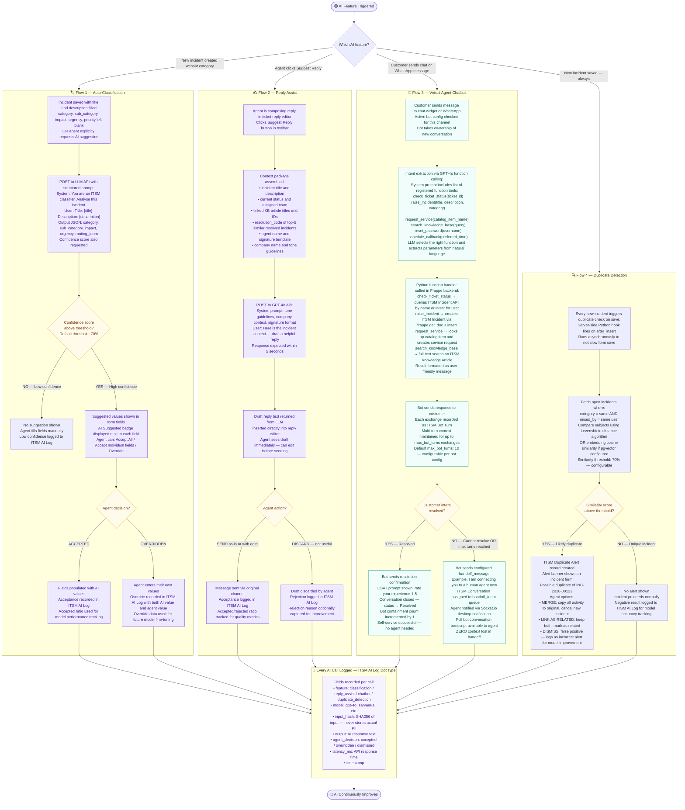

---

## 10. Asset Management

> **Purpose:** Track every IT asset from purchase order to disposal. Hardware assets automatically link to CMDB CIs when deployed. Software licenses are tracked against deployment counts for compliance. Full financial integration with ERPNext for depreciation.

**Actors:** Asset Manager · Procurement Team · Technician · CI Owner · ERPNext (financial system)

```mermaid
flowchart TD
    AST_START([🟢 Asset Lifecycle Begins]) --> AST_TYPE

    AST_TYPE{Asset type?}
    AST_TYPE -->|Hardware asset| AST_HW_FLOW
    AST_TYPE -->|Software license| AST_SW_FLOW

    subgraph AST_HW_FLOW["💻 Hardware Asset Lifecycle"]
        AST_H1["PROCUREMENT — Status: On Order<br/>Asset Manager creates ITSM Asset record at purchase time<br/>Links to ERPNext Purchase Order via purchase_order field<br/>Records: purchase_cost, warranty_expiry, manufacturer, model, serial_number<br/>Vendor linked to ERPNext Supplier record"]
        AST_H1 --> AST_H2["GOODS RECEIVED — Status: In Stock<br/>PO goods receipt confirmed in ERPNext<br/>ITSM Asset status updated to In Stock<br/>Physical QR code label auto-generated via Python qrcode library<br/>QR encodes asset ID for physical tagging<br/>Asset placed in stockroom location record"]
        AST_H2 --> AST_H3["DEPLOYMENT — Status: In Use<br/>Asset assigned to employee via assigned_to field — links to ERPNext Employee<br/>assigned_date recorded<br/>ITSM Asset Assignment History child table entry created<br/>Every future assignment and return also logged here"]
    end

    AST_H3 --> AST_AUTO1

    subgraph AST_AUTO1["⚡ Auto-Trigger — On Asset Status = In Use"]
        AST_A1["CMDB INTEGRATION:<br/>System searches ITSM CI records by serial_number<br/>• CI found → link asset to CI via linked_ci field<br/>• CI not found → prompt Asset Manager to create CI from asset template<br/>  One-click creates ITSM CI pre-filled from asset attributes<br/><br/>ERPNEXT INTEGRATION:<br/>ERPNext Asset DocType created or linked for financial tracking<br/>ERPNext Asset Depreciation Schedule created<br/>Annual depreciation Journal Entries posted by ERPNext automatically"]
    end

    AST_AUTO1 --> AST_DEPR

    subgraph AST_DEPRECIATION["📉 Depreciation Calculation — On Every Save"]
        AST_DEPR["current_nbv computed on each save:<br/>Straight-line: NBV = purchase_cost - (annual_depr × years_elapsed)<br/>Written-down value: NBV = purchase_cost × (1 - depr_rate)^years<br/>Salvage value respected — NBV never drops below salvage_value<br/>Useful life configured in useful_life_years field<br/>ERPNext posts annual depreciation JE automatically"]
    end

    AST_DEPR --> AST_REPAIRDEC

    AST_REPAIRDEC{Asset condition?}
    AST_REPAIRDEC -->|Needs repair| AST_REPAIR["Status → In Repair<br/>ITSM Incident raised for repair tracking<br/>Vendor linked — ERPNext Supplier<br/>Return date expected tracked<br/>Assignment suspended during repair<br/>On return: Status → In Use<br/>New assignment history entry created"]
    AST_REPAIR --> AST_DEPR
    AST_REPAIRDEC -->|Functional — continue in use| AST_ALERTS

    subgraph AST_ALERTS["⚡ Auto-Trigger — Daily Background Job — Asset Alerts"]
        AST_AJ["WARRANTY EXPIRY — 90 days before warranty_expiry:<br/>Alert to CI owner and IT Manager<br/>ITSM CI Alert record created<br/><br/>AMC EXPIRY — 60 days before amc_expiry:<br/>Alert to Asset Manager for renewal action<br/><br/>DAILY DEPRECIATION UPDATE:<br/>NBV recalculated if within depreciation period<br/>Flagged if NBV has reached salvage value"]
    end

    AST_ALERTS --> AST_DISPOSALDEC

    AST_DISPOSALDEC{End of life<br/>or to be<br/>disposed?}
    AST_DISPOSALDEC -->|YES — Initiate disposal| AST_RETIRE["Status → Retired<br/>Disposal request raised by Asset Manager<br/>disposal_method selected:<br/>Sold / Donated / Scrapped / Returned to Vendor / Certified Destruction<br/>Approval required — configurable approver<br/>Asset removed from deployment — assigned_to cleared"]
    AST_RETIRE --> AST_CERT["Approval received<br/>disposal_certificate upload MANDATORY<br/>Evidence of secure disposal for audit compliance<br/>Status → Disposed"]
    AST_CERT --> AST_AUTO2

    subgraph AST_AUTO2["⚡ Auto-Trigger — On Asset Disposed"]
        AST_A2["• Linked ITSM CI status → Retired<br/>• ERPNext: residual NBV written off via Journal Entry<br/>• Assignment history record closed with disposal_date<br/>• disposal_certificate archived to Frappe private files<br/>• Asset removed from active inventory reports<br/>• Depreciation schedule terminated in ERPNext"]
    end

    AST_AUTO2 --> AST_HW_END([🏁 Asset Lifecycle Complete])
    AST_DISPOSALDEC -->|NO — Continue in use| AST_ALERTS

    subgraph AST_SW_FLOW["📦 Software License Compliance Flow"]
        AST_S1["SOFTWARE REGISTRATION<br/>Asset Manager creates ITSM Software License record:<br/>• software_name, vendor — linked to ERPNext Supplier<br/>• license_type: Per User Named / Per User Concurrent / Per Device / Site / Enterprise<br/>• license_count_purchased: total seats bought<br/>• license_key stored encrypted in Password field<br/>• version, expiry_date, eol_date"]
        AST_S1 --> AST_S2["DEPLOYMENT TRACKING<br/>license_count_deployed auto-computed:<br/>Count of ITSM Asset Deployment records for this software<br/>Updated on every new deployment or removal<br/>No manual entry required — auto-calculated on save"]
        AST_S2 --> AST_S3["COMPLIANCE STATUS — Auto-computed on every save:<br/>Compliant → deployed count ≤ purchased count<br/>Over-Licensed → deployed count significantly below purchased → WASTE<br/>Under-Licensed → deployed count > purchased count → RISK of audit fine"]
        AST_S3 --> AST_SWDEC{Compliance<br/>status?}
        AST_SWDEC -->|COMPLIANT| AST_SWOK["No action required<br/>Status shown as green on compliance dashboard<br/>Monitored for changes"]
        AST_SWDEC -->|OVER-LICENSED — waste| AST_SWOVER["IT Manager notified: potential cost saving<br/>Review: can licenses be reduced at renewal?<br/>Flagged on Software License Compliance Report"]
        AST_SWDEC -->|UNDER-LICENSED — risk| AST_SWUNDER["IMMEDIATE ALERT to ITSM Admin<br/>Risk: software audit may identify violation<br/>Action required: purchase additional licenses ASAP<br/>Flagged as critical on compliance dashboard"]
    end

    subgraph AST_SW_ALERTS["⚡ Auto-Trigger — Daily Software Alerts"]
        AST_SA["LICENSE EXPIRY — 90 days before expiry_date:<br/>Alert to Asset Manager for renewal action<br/><br/>END OF LIFE — 180 days before eol_date:<br/>Alert with upgrade recommendation<br/>Migration planning should begin<br/><br/>UNDER-LICENSED — immediate:<br/>Real-time alert on every compliance recalculation<br/>Does not wait for daily job"]
    end

    AST_SWOK & AST_SWOVER & AST_SWUNDER --> AST_SA
    AST_SA --> AST_SW_END([🔄 License Monitored Continuously])

    classDef stepStyle fill:#ECFDF5,stroke:#16A34A,color:#14532D
    classDef decStyle fill:#FFFBEB,stroke:#F59E0B,color:#78350F
    classDef autoStyle fill:#F5F3FF,stroke:#8B5CF6,color:#4C1D95
    classDef alertStyle fill:#FEF2F2,stroke:#EF4444,color:#7F1D1D
    classDef swStyle fill:#EFF6FF,stroke:#3B82F6,color:#1E3A8A

    class AST_H1,AST_H2,AST_H3,AST_DEPR,AST_REPAIR,AST_RETIRE,AST_CERT,AST_S1,AST_S2,AST_S3,AST_SWOK stepStyle
    class AST_TYPE,AST_REPAIRDEC,AST_DISPOSALDEC,AST_SWDEC decStyle
    class AST_A1,AST_A2,AST_AJ,AST_SA autoStyle
    class AST_SWUNDER,AST_SWOVER alertStyle
```

---

## 11. Cross-Module Integration Map

> **Purpose:** Shows exactly how all 10 modules connect to each other, to ERPNext, and to the shared platform services (SLA Engine and Workflow Engine).

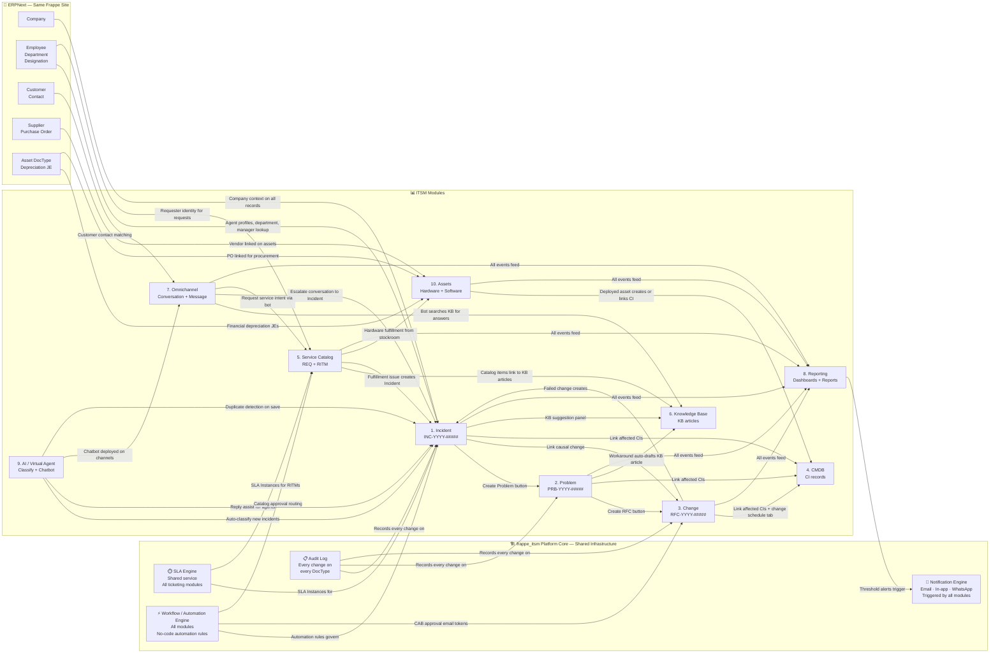

### SLA Engine — Cross-Module Service Detail

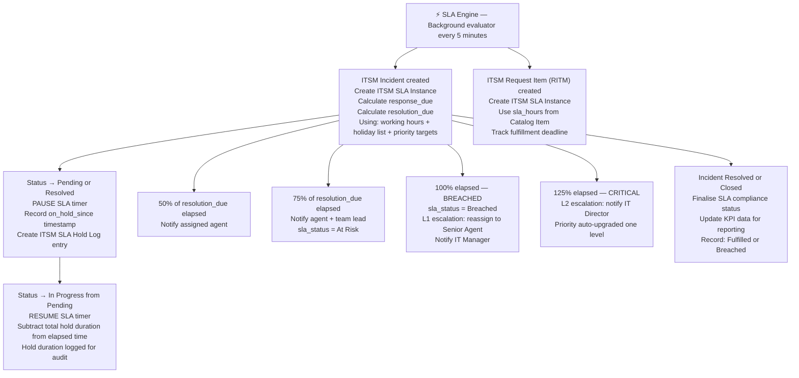

### Workflow / Automation Engine — Cross-Module Service Detail

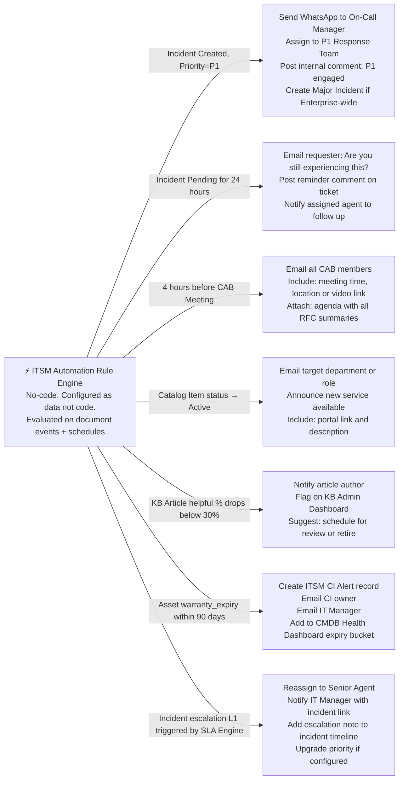

---

## Appendix — Key Business Rules Reference

### Priority Matrix (Impact × Urgency)

| Impact \ Urgency | 1-Critical | 2-High | 3-Medium | 4-Low |
|------------------|-----------|--------|----------|-------|
| 1-Enterprise Wide | **P1** Critical | **P1** Critical | **P2** High | **P3** Moderate |
| 2-Department Wide | **P1** Critical | **P2** High | **P3** Moderate | **P4** Low |
| 3-Group Wide | **P2** High | **P3** Moderate | **P3** Moderate | **P4** Low |
| 4-Individual | **P3** Moderate | **P4** Low | **P4** Low | **P5** Planning |

### Master KPI Reference

| KPI | Formula | Owner Module | Target |
|-----|---------|--------------|--------|
| SLA Compliance Rate | Incidents within SLA / Total × 100 | Incident | ≥ 92% |
| First Call Resolution | Closed without reassignment / Total × 100 | Incident | ≥ 70% |
| MTTR (Response) | Avg(first_response_at − created_at) | Incident | P3 < 2h |
| MTTR (Resolution) | Avg(resolution_at − created_at) | Incident | P3 < 24h |
| CSAT Score | Avg post-resolution rating 1–5 | Incident + Omnichannel | ≥ 4.2 / 5 |
| Reopen Rate | Reopened / Resolved × 100 | Incident | < 3% |
| Change Success Rate | Successful changes / Total × 100 | Change | ≥ 96% |
| Unauthorized Changes | Retrospective RFCs / Total × 100 | Change | < 1% |
| CMDB Completeness | Mandatory fields filled / Total × 100 | CMDB | ≥ 90% |
| Catalog Fulfillment SLA | RITMs fulfilled within SLA / Total × 100 | Catalog | ≥ 90% |
| KB Deflection Rate | Deflected sessions / Total portal sessions × 100 | KB | ≥ 20% |
| Bot Containment Rate | Bot-resolved sessions / Total sessions × 100 | AI / VA | ≥ 30% |
| AI Classification Accuracy | Agent-accepted AI suggestions / Total × 100 | AI | ≥ 80% |
| License Compliance Rate | Compliant licenses / Total licenses × 100 | Assets | 100% |
| Asset Utilisation | Assets In Use / Total active × 100 | Assets | ≥ 90% |

### DocType Naming Series Reference

| Module | DocType | Naming Series |
|--------|---------|--------------|
| Incident | ITSM Incident | INC-YYYY-##### |
| Problem | ITSM Problem | PRB-YYYY-##### |
| Change | ITSM Change | RFC-YYYY-##### |
| CAB Meeting | ITSM CAB Meeting | CAB-YYYY-### |
| Service Request | ITSM Service Request | REQ-YYYY-##### |
| Request Item | ITSM Request Item | RITM-YYYY-##### |
| CI | ITSM CI | CI-{CLASS_CODE}-##### |
| Knowledge Article | ITSM Knowledge Article | KB-YYYY-##### |
| Conversation | ITSM Conversation | CONV-##### |
| Message | ITSM Message | MSG-##### |
| Asset | ITSM Asset | AST-##### |

---

*End of frappe_itsm Process Flowcharts — All 10 Modules + Integration Map*
*Generated from: frappe_itsm PRD v1.0 | ITSM-PRD-2026-001 | May 2026*
