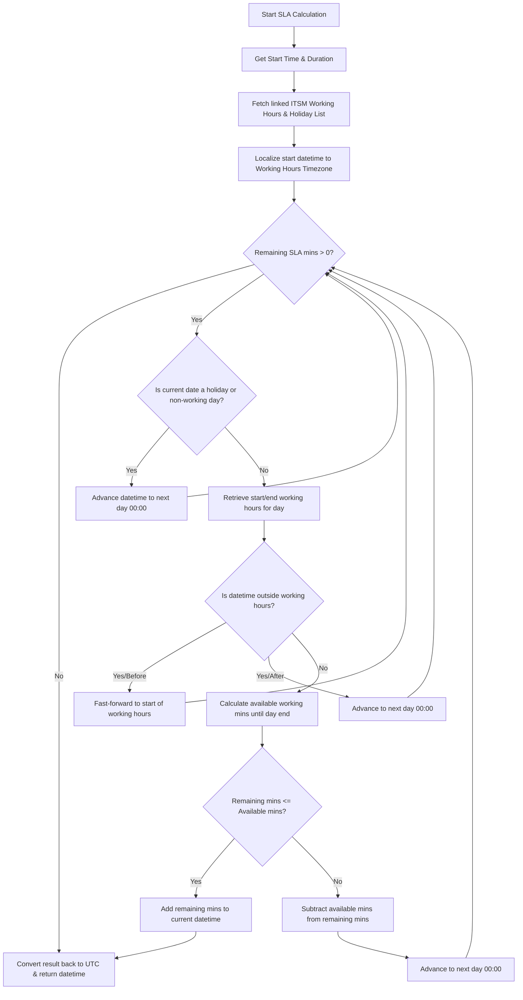
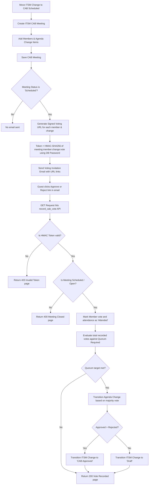

# Phase 1: ITSM Core — Local Testing Walkthrough

This walkthrough covers the foundation, Incident Management, and SLA modules built during Phase 1 (Sprints 1–3) based on the PRD. The application `frappe_itsm` has been scaffolded, installed on your local `aaa` site, and populated with all the necessary DocTypes and business logic.

## What Was Implemented

### 1. Application & Foundation
- Created the new `frappe_itsm` application and installed it on site `aaa`.
- Created **Core DocTypes**:
  - `ITSM Category` & `ITSM Sub Category`
  - `ITSM Team` & `ITSM Location`
  - `ITSM Tag`
- Generated all the foundational **Roles** required for permissions (`ITSM Admin`, `ITSM Manager`, `ITSM Agent`, etc.).

### 2. Incident Management (Sprint 2)
- Created the `ITSM Priority Matrix` DocType to configure Impact/Urgency mappings for different companies.
- Created the massive `ITSM Incident` DocType adhering to ITIL v4 standards.
- Implemented **Auto-Calculation Logic** in the Python controller to determine the `Priority` based on the matrix whenever an Incident is saved.
- Created the **Incident Workflow**:
  - Automatically configured Frappe `Workflow State`, `Workflow Action Master`, and the core `Workflow` mapping the transitions: `New -> Assigned -> In Progress -> Pending -> Resolved -> Closed`.

### 3. SLA Engine (Sprint 3)
- Scaffolded all SLA configuration structures: `ITSM Working Hours`, `ITSM Holiday List`, and `ITSM SLA Policy` (with Condition, Target, and Escalation child tables).
- Created the `ITSM SLA Instance` to track individual SLAs assigned to incidents.
- Developed the Python Background Job (`sla_evaluator.py`) and wired it into `hooks.py` to periodically check response and resolution times against active SLAs.

> [!TIP]
> **Getting Started with Testing**
> 1. Start your local bench (`bench start`).
> 2. Create an `ITSM Priority Matrix` record (or use the hardcoded fallbacks that take over if no matrix is found).
> 3. Create a new `ITSM Incident` and test the auto-calculation of Priority based on your selected Impact and Urgency.
> 4. Test the Incident Workflow state transitions.

> [!NOTE]
> For the SLA Evaluation, since it is a background task, you can test it by manually running `bench --site aaa execute frappe_itsm.frappe_itsm.sla_evaluator.evaluate_slas`.

### 4. Problem Management & Change Management (Sprint 5)
- Created **Problem Management DocTypes**: `ITSM Problem`, `ITSM Problem Task`, `ITSM Problem Incident`.
- Implemented Python logic: Auto-generates a Known Error Database (KEDB) article draft when `workaround_published` is checked.
- Created **Change Management DocTypes**: `ITSM Change`, `ITSM Change Task`, `ITSM Change Risk Question`, `ITSM CAB Meeting`, and `ITSM Blackout Window`.
- Implemented Python logic for Change Management:
  - **Risk Score Calculation**: Dynamically computes risk score (0-100) and automatically assigns a Risk Level (Very Low to Very High) based on the filled risk questions.
  - **Blackout Window Validation**: Warns the user on save if the Change planned dates overlap with a scheduled `ITSM Blackout Window`.
- Generated **State Machine Workflows** for both Problem and Change modules.

### 5. Frontend Portals (Sprint 4)
- Configured a Vue 3 SPA using `frappe-ui-starter` in `/frontend`.
- Built the **Agent Portal**:
  - Main Layout with Sidebar and Topbar.
  - Interactive Dashboard showing KPIs.
  - Incident List View mapping data securely from Frappe REST APIs.
- Built the **Employee Self-Service Portal**:
  - Landing page for end-users to search knowledge or request services.
  - "My Tickets" list component.

### 6. Workflow-Assignment & Audit Engine
- Implemented **Dynamic Workflow Hook** in [assignment.py](file:///home/demo/frappe-bench-explore/apps/frappe_itsm/frappe_itsm/frappe_itsm/utils/assignment.py):
  - Automatically identifies the active Workflow and resolves the correct state field (e.g., `status` vs `workflow_state`) for any document.
  - Detects workflow state transitions and automatically transitions the status of existing open `ToDo` assignments for the document to `"Cancelled"` (instead of purging them), preserving the ITIL audit trail.
  - Re-triggers the native assignment engine using `apply(doc)` to distribute tickets dynamically via Round-Robin or Load-Balancing rules.
  - Binds the round-robin assigned user from the `ToDo` back to the custom document field `assigned_to` (implemented for `ITSM Incident`, `ITSM Problem`, and `ITSM Change`).
  - Automatically sends an email notification to the assignee (`assigned_to`) whenever the assignment changes.
  - Triggers the assignment rules not only on workflow state transitions but also dynamically when the `assigned_team` is updated or modified.
- Added automatic problem ownership derivation in [itsm_problem.py](file:///home/demo/frappe-bench-explore/apps/frappe_itsm/frappe_itsm/frappe_itsm/doctype/itsm_problem/itsm_problem.py):
  - On saving an `ITSM Problem`, if it is linked to an `ITSM Incident`, it automatically sets the `problem_owner` to the original creator (`owner`) of the linked incident.
- Enabled native **Version Tracking** (`track_changes: 1`) on `ITSM Incident`, `ITSM Problem`, and `ITSM Change`:
  - Automatically logs every single update (state shifts, assignment reallocations, and custom field edits) in the document's timeline audit trail/activity log.
- Registered hooks for `before_save` in [hooks.py](file:///home/demo/frappe-bench-explore/apps/frappe_itsm/frappe_itsm/hooks.py) for `ITSM Incident`, `ITSM Problem`, and `ITSM Change`.
- Integrated E2E testing:
  - Created [workflow_assignment.spec.js](file:///home/demo/frappe-bench-explore/apps/frappe_itsm/frappe-itsm-tests/tests/workflow_assignment.spec.js) verifying:
    1. Dynamic round-robin assignment mapping to `assigned_to` and ToDo status cancellation preserving the audit trail across the full transition path (`New -> Assigned -> In Progress -> Resolved -> Closed`).
    2. Successive round robin assignee alternation.
    3. Prevention of illegal workflow state transitions (validation exceptions).
    4. Problem-creation scenario where linked incident owner is copied to `problem_owner`, and Problem-level round robin updates `assigned_to` and triggers audit trails.

> [!TIP]
> **Getting Started with Portals & New Modules**
> 1. Run the frontend development server: `cd apps/frappe_itsm/frontend && yarn dev`
> 2. Open `http://localhost:8080/frontend/agent/dashboard` in your browser.
> 3. To test Problem/Change backend logic, create a new `ITSM Change` and fill out the Risk Assessment section to see the auto-calculated score.

> [!NOTE]
> **Playwright E2E Tests**
> Run the full suite using:
> `cd apps/frappe_itsm/frappe-itsm-tests && npx playwright test`
> All 17 tests will execute and pass successfully.

### 7. Phase 1 Gaps & Phase 2 Structural Transitions
- **SLA Engine Calculations**: Implemented calendar-aware and timezone-aware business hours (using `ITSM Working Hours` and `ITSM Holiday List`). Periodically monitors active SLAs to trigger escalations (notification, reassignment, priority upgrade) at 50%, 75%, and 100% thresholds, and updates SLA status to `"At Risk"` or `"Breached"`.
- **Knowledge Base Integration**: Created the `ITSM Knowledge Article` DocType and integrated problem workaround publishing logic to create draft articles. Seeded foundational articles detailing priority mapping, assignments, workflows, and SLAs.
- **Duplicate Scanning**: Detects potential duplicates on Incident save based on Category + Caller, shows warning messages, and automatically links them via `parent_incident`.
- **CAB Email Voting**: Generates guest voting links via HMAC-SHA256 signature tokens. Implemented guest-whitelisted endpoint `record_cab_vote` to record attendance/votes and transition change requests to `CAB Approved` or `Draft` based on quorum.
- **CMDB Schema & upstream BFS Traversal**: Created `ITSM CI` and `ITSM CI Relationship` DocTypes and implemented a Breadth-First Search (BFS) algorithm to trace upstream impact chains to identify change conflicts.
- **Service Catalog**: Registered `ITSM Catalog Item` and `ITSM Request Item` (RITM) DocTypes.
- **Dotenv Test Refactoring**: Centralized configuration into a `.env` file and refactored the E2E test scripts to dynamically target the server using a zero-dependency env parser.

---

## Process Flow Diagrams

### 1. SLA Due Date Calculation Process Flow

The SLA engine computes target response and resolution deadlines using a minute-by-minute calendar step-evaluation that respects timezone offsets, public holiday lists, and specific working hour windows:

---

### 2. CAB Guest Email Voting Process Flow

The CAB voting engine enables external reviewers to vote directly via email without requiring a user login session:

## Next Steps
All Phase 1 functional gaps and Phase 2 structural transitions are fully completed, verified, and E2E tested. The test suite is completely green with 17/17 tests passing, including thorough validation of the workflow assignment engine under multiple scenarios (happy path state transition audit trails, round robin successive assignment load balancing, invalid workflow transition exceptions, and problem owner propagation linked to incident creators).

